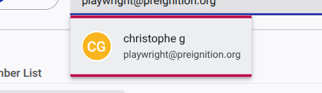

# How to Add a Member to Your Organisation

If you are the Owner of your organisation on the GDS Commitments Portal, you can invite new members to join your team and assign them specific roles.

If you prefer, you can watch a YouTube video tutorial:

<lite-youtube videoid="WCFT7Ivkf6g" title="How to Add a Member to your Organisation" ></lite-youtube>

## Step 1: Access the Team Page

1. Log in to the GDS Commitments Portal and navigate to your **My Space** dashboard.
2. From the side navigation menu, click on **Team**.

## Step 2: Initiate the Invitation

1. In the "Membership" section, click the **Add Members** button.

## Step 3: Search and Select User

1. A new form will appear. In the **Search or Invite Users** dropdown field, start typing the email address or name of the person you want to invite.

1. If the user already has an account on the portal, their profile will appear in the dropdown list. Click on their name to select them. If they do not have an account, you can still enter their email address to send an invitation.

## Step 4: Assign a Role

1. Once the user is selected, use the **Select Role** dropdown to assign them appropriate permissions. Available roles typically include:
   * **Owner:** Full administrative rights.
   * **Editor:** Can view, edit, and create commitments.
   * **Guest:** Read-only access.

## Step 5: Send the Invitation

1. Click the button with the "Add user" icon (the person with a plus sign) to finalize the process.

The invited user will receive an email containing a link to join your team. Once they accept the invitation (and complete their account registration if necessary), they will appear in your Member List with the assigned role.
