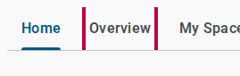
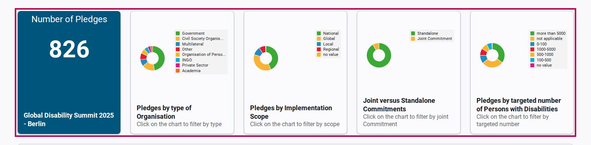
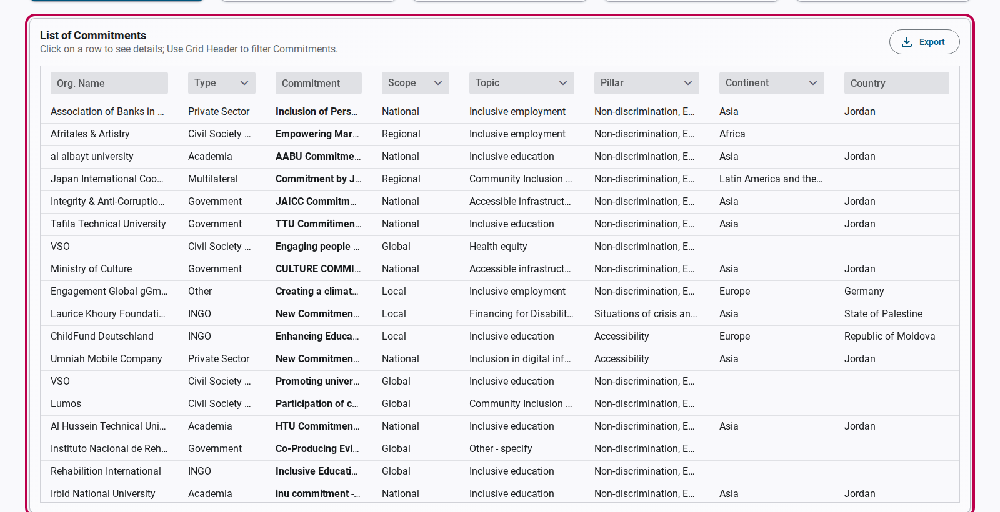
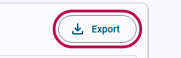

# How to Access and Download Commitments

The **GDS Commitments Portal** allows users to explore, filter, and download commitments submitted across all Global Disability Summit (GDS) events, including GDS 2018, GDS 2022, and GDS 2025.

You can access this information directly from the portal without signing up or logging in.

> [!TIP]
> The portal is fully public. No registration or credentials are required to view the datasets or download commitment data.

---

## Step 1: Go to the GDS Commitment Portal

First, navigate to the GDS Commitment Portal. Locate and click on the **Overview** tab in the main navigation menu. This will take you to the dataset containing commitments submitted across all summit years.

<figure>
  
  <figcaption>Click the Overview tab to view the dataset containing commitments across all summit years.</figcaption>
</figure>

---

## Step 2: Explore and Filter Commitments

You can filter and refine the dataset using two main methods: interactive charts or the dataset table header filters.

### Method A: Filter using Interactive Charts

The charts displayed on the page are interactive. You can filter the commitments displayed in the table below the charts by simply clicking on any segment or category of the visualizations.

For example, you can filter commitments by clicking on segments representing:

* **Organization type** (e.g., INGOs, CSOs, Governments)
* **Geographical scope** (e.g., National, Regional, Global)
* **Joint commitments** (whether the commitment is shared or individual)
* **Targeted number of Persons with Disabilities**

<figure>
  
  <figcaption>Click directly on the chart categories to filter commitments interactively.</figcaption>
</figure>

### Method B: Filter using the Dataset Table

You can search and filter commitments directly within the dataset table. Use the **Grid Header filters** at the top of each column in the table to search by text, choose specific drop-down filter options, or sort columns.

<figure>
  
  <figcaption>Use Grid Header filters to search and query commitments directly within the table.</figcaption>
</figure>

---

## Step 3: View Individual Commitment Details

To examine a specific commitment in detail, **click on any row** within the dataset table. This action will open a detailed view of the selected commitment, showing the full submission text, targets, timeline, and associated categories.

---

## Step 4: Export Data

Once you have applied your desired filters, you can download the filtered list of commitments for offline analysis.

Click the **Export** button located at the top-right of the commitments table to download the filtered commitments into a standard CSV file.

<figure>
  
  <figcaption>Click the Export button to download the filtered dataset as a CSV file.</figcaption>
</figure>

---

## Related Content

* [GDS Portal Overview](../index.md)
* [Submitting New Commitments](./create-commitment.md)
