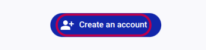
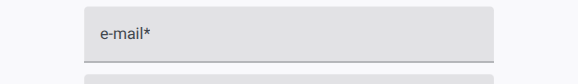
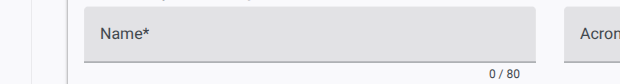
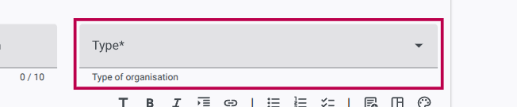
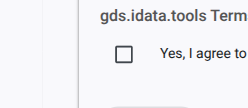
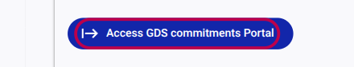

# How to Create an Account

YouTube video tutorial [here](https://youtu.be/ty1FK62Bu5Q)

To submit commitments or report on past pledges, you first need to register and create an account on the GDS Commitments Portal.

## Step 1: Start Registration

1. From the portal's homepage, click the **Start Submitting Commitments** button.
2. On the sign-in screen, locate and click the **Create an account** link or button.

## Step 2: Provide Account Details

You will be asked to fill out a standard registration form.

1. **e-mail:** Enter a valid email address. This will be your login ID and will be used for verification.
2. **password:** Create a secure password.
3. **first name:** Enter your first name.
4. Click **Next** to proceed to the next step.

## Step 3: Set Organisation Details

After creating your basic user account, you must associate it with an organization. If your organization is not yet registered on the portal, you will create a new profile for it.

1. Choose the option to **Set details for new organisation**.
2. **Name:** Enter the official name of your organization.
3. **Type:** Select the category that best fits your organization (e.g., INGO, Government, etc.) from the dropdown menu.
4. **Description:** Provide a brief description of your organization.
5. Click **Next**.

## Step 4: Verify Your Email

1. Check the inbox of the email address you provided in Step 2.
2. Look for an email from the GDS Portal containing a verification link.
3. Click the link to verify your email address.
4. Return to the portal wizard and click **Next**.

## Step 5: Agree to Terms

1. Read through the provided Terms of Service.
2. Check the box to indicate your agreement.
3. Click **Next**.

## Step 6: Success

Your account and organization profile are now created!

Click the **Access GDS commitments Portal** link to enter your personalized dashboard ("My Space") where you can begin drafting new commitments.

