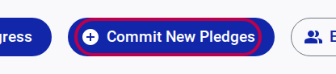
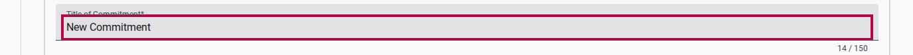
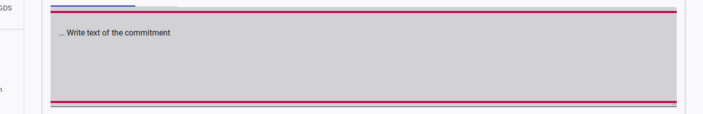
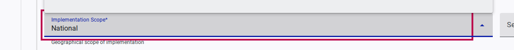
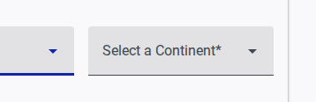
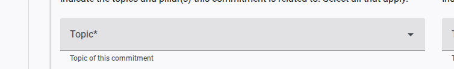
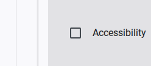
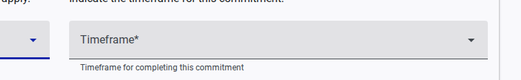
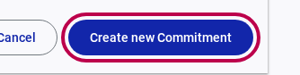

# How to Create a Commitment

Once you have registered your organization and verified your account, you can start submitting pledges to the Global Disability Summit. This guide will walk you through the process of creating a new individual commitment.

## Step 1: Start a New Commitment

1. Log in to the portal and navigate to the **Welcome** page of your "My Space" dashboard.
2. Click the **Commit New Pledges** button.

   

3. You will be taken to the Commitments overview. Click on the **Create New Commitment** button within the "New Commitment" card.

   

## Step 2: Fill Out the Commitment Form

The form is divided into sections. All fields marked with an asterisk (*) are mandatory.

### General Information

1. **Title of Commitment:** Enter a clear and concise title for your pledge.
    
2. **Text of Commitment:** Describe the full details of your commitment in the text area.
    

### Geographical Scope and Location

1. **Implementation Scope:** Select the level of implementation (e.g., National, Regional, Global) from the dropdown menu.
    
2. **Select a Continent:** Choose the primary continent where this commitment will take effect.
    

### Categorization

1. **Topic:** Choose the main topic that best categorizes your commitment.
    
2. **Pillars:** Check the box(es) corresponding to the GDS pillars that your commitment addresses (e.g., Accessibility).
    

### Timeframe

1. **Timeframe:** Select the expected duration or completion date for your commitment from the dropdown menu.
    

## Step 3: Submit Your Commitment

1. Review all the information you have entered to ensure it is accurate and complete.
2. Click the **Create new Commitment** button at the bottom of the form to save your pledge.

   

Your commitment is now saved in the system. You can view and edit it later from your **Commitments** dashboard.
