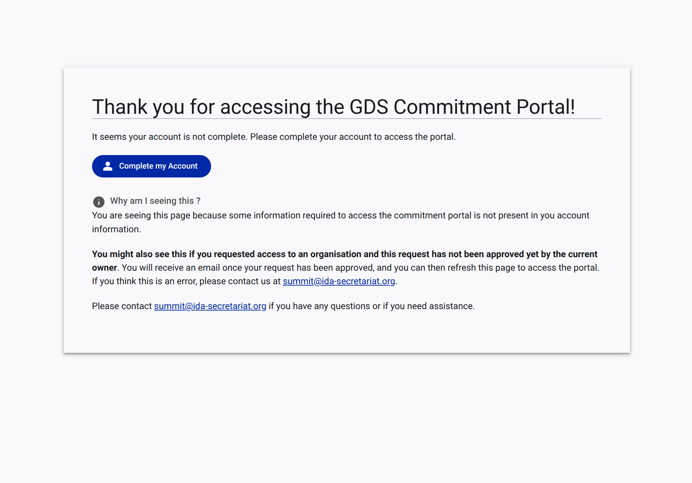
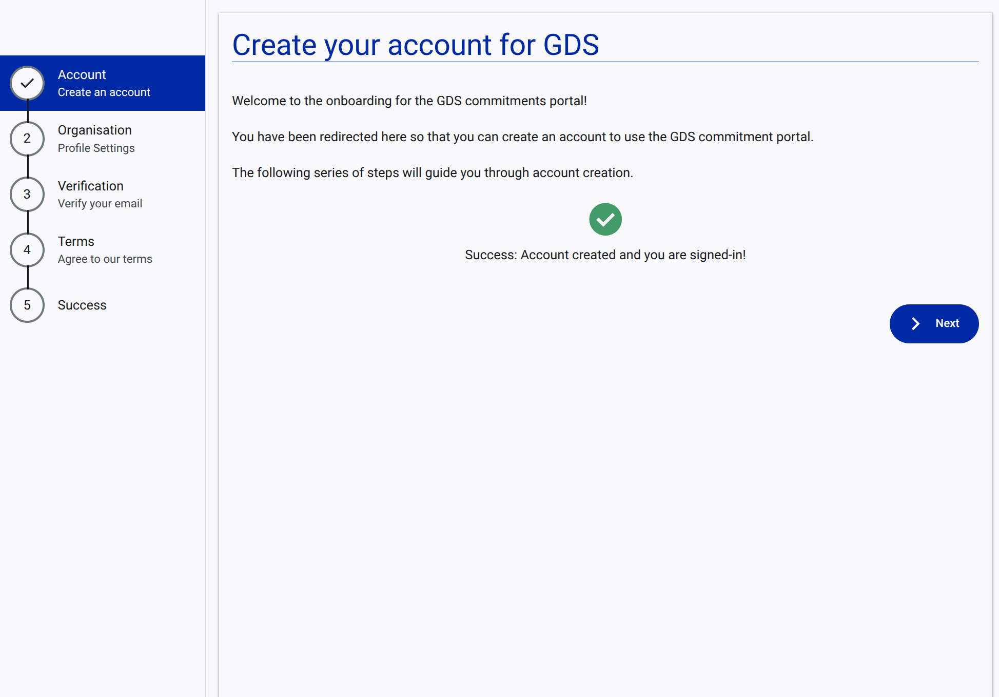
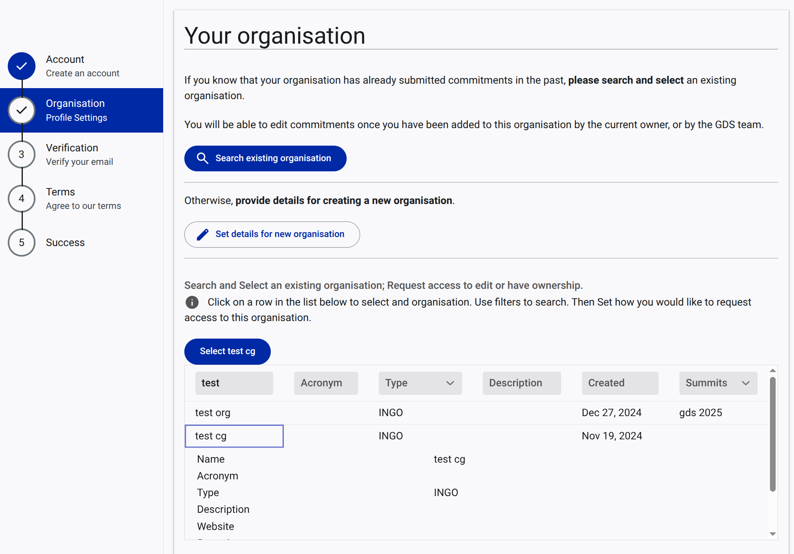
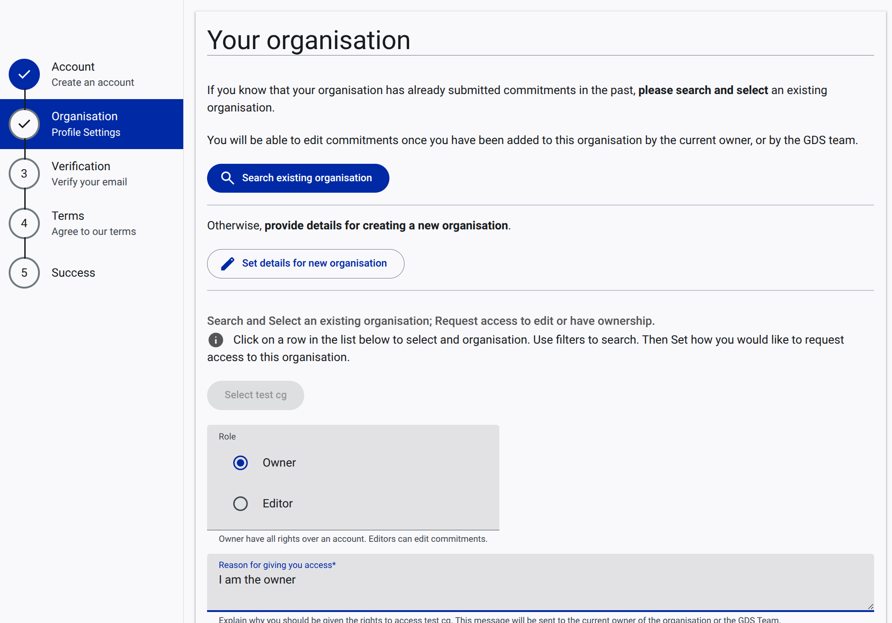
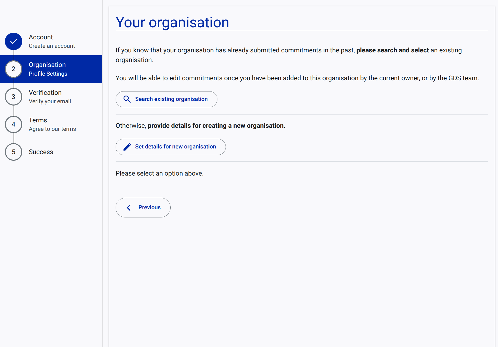
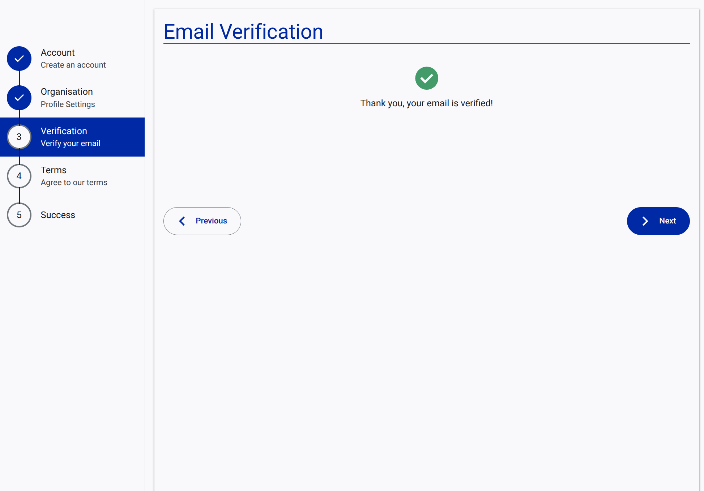
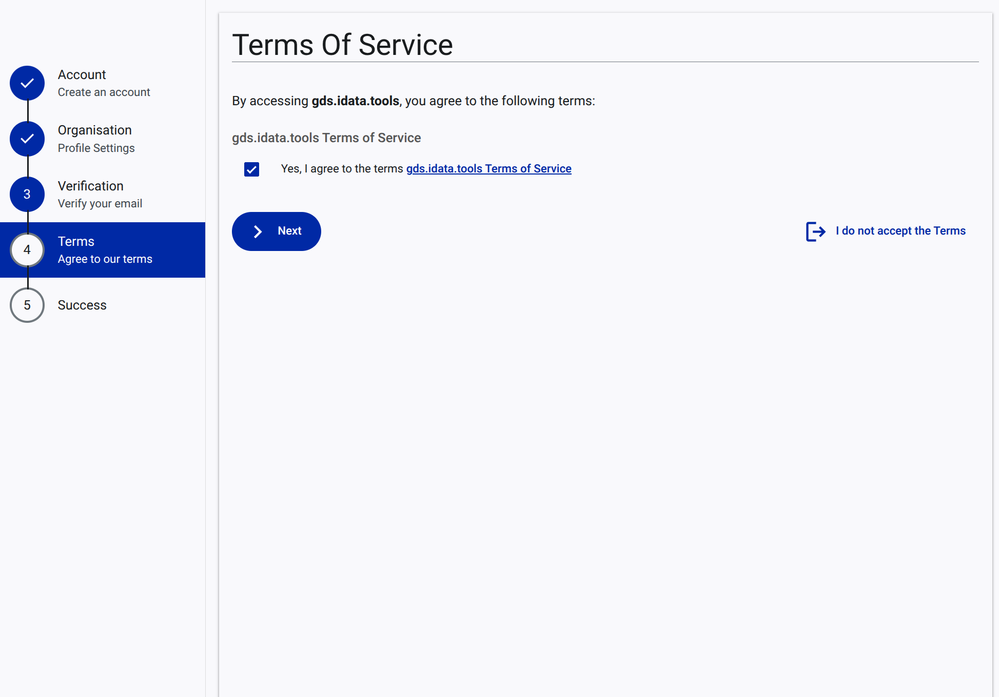
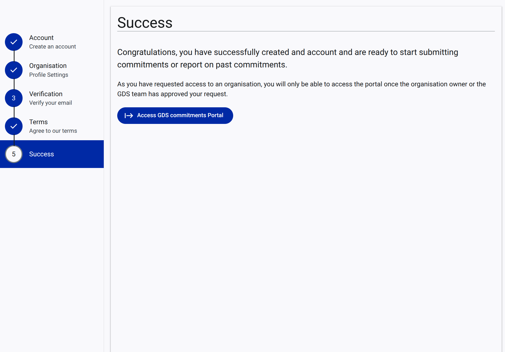

# How to Complete Your Account

If you attempt to access the GDS Commitments Portal but your account is missing required information (such as an organization affiliation, email verification, or terms acceptance), you will be prompted to complete your account. This guide walks you through that process.

## Step 1: Start the Completion Process

1. When you encounter the "Thank you for accessing the GDS Commitment Portal!" message indicating your account is incomplete, click the **Complete my Account** button.

## Step 2: Account Confirmation

1. You will be redirected to the onboarding wizard, starting at the **Account** step. This confirms your basic account credentials.
2. Click **Next** to proceed.

## Step 3: Organisation Profile Settings

You must associate your account with an organization.

### Option A: Request Access to an Existing Organisation

If your organization is already registered:
1. Search for your organization in the provided list and select it.
2. Choose your requested **Role** (e.g., Owner, Editor).
3. Provide a reason for requesting access and click **Next**. The current owner will review your request.

### Option B: Set Details for a New Organisation

If your organization is new to the portal:
1. Select **Set details for new organisation**.
2. Fill out the form with your organization's name, type, and description.
3. Click **Next**.

## Step 4: Verify Your Email

For security, you must verify your email address.
1. Check your email inbox for a verification link and click it.
2. Return to the portal. Once verified, you will see a success message on the Verification step.
3. Click **Next**.

## Step 5: Agree to Terms of Service

1. Review the Terms of Service.
2. Check the box to agree: **"Yes, I agree to the terms"**.
3. Click **Next**.

## Step 6: Success

Your account completion is now finished. 
* If you joined an existing organization, you must wait for approval.
* Otherwise, click **Access GDS commitments Portal** to enter your workspace.

