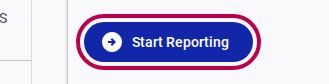
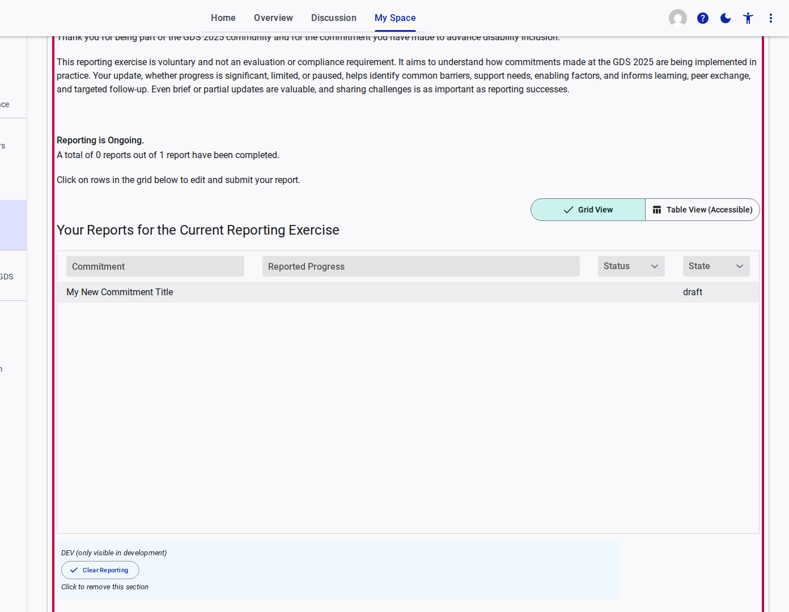

# How to Start Reporting

During active reporting periods, you will be invited to report on the progress of the commitments your organization has submitted. This guide shows you how to initiate that process.

## Step 1: Access the Reporting Section

1. Log in to the GDS Commitments Portal and go to your **My Space** dashboard.
2. In the side navigation menu, click on **Reporting**.
3. Alternatively, if a reporting period is open, you can click the **Report On Progress** button directly from your Welcome dashboard.

## Step 2: Initiate the Reporting Exercise

If you have submitted commitments that are eligible for an update, you can start the reporting exercise.

1. On the Reporting page, look for the **Start Reporting** button and click it.
   

## Step 3: View Your Reports

1. Once the reporting exercise is initiated, the system will generate draft reports for your eligible commitments.
2. You will be presented with a grid titled "Your Reports for the Current Reporting Exercise". This grid lists your commitments and their current reporting status (e.g., "draft").
3. The page also provides guidance explaining that the reporting exercise is voluntary and aims to understand implementation progress, identify barriers, and inform peer exchange.
4. To begin filling out a specific report, click on the corresponding row in the grid.
   
