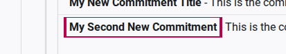
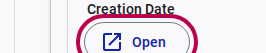
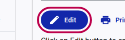
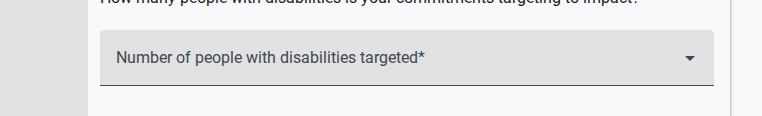
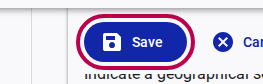
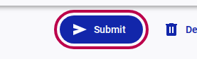

# How to Submit a Commitment

After you have created a draft commitment, you must officially submit it to the GDS secretariat for review. This guide outlines the final steps to finalize and submit your pledge.

## Step 1: Open Your Commitment

1. Log in to the portal and navigate to the **Commitments** page in your "My Space".
2. In the "Your Commitments" list, locate the draft commitment you wish to submit.
3. Click on the title of the commitment to reveal the quick actions.
   
4. Click the **Open** button to view the full details of the commitment.
   

## Step 2: Edit and Finalize Details

Before submitting, ensure all information is accurate and complete.

1. In the detailed view, click the **Edit** button to unlock the form.
   
2. Complete any remaining required fields. For example, you may need to specify the **Number of people with disabilities targeted** by this pledge.
   
3. Once you are satisfied with the details, click the **Save** button to store your final changes.
   

## Step 3: Submit for Review

1. After saving, the commitment is ready for final submission.
2. Click the **Submit** button. 
   

Your commitment has now been officially submitted. The status in your commitments list will update to reflect that it is under review by the GDS team.
