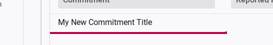
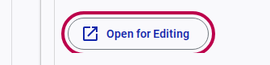
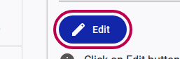
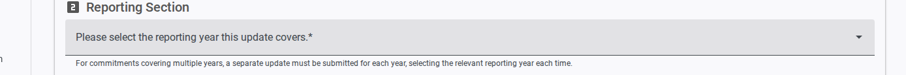
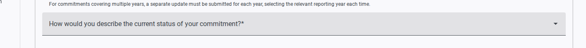
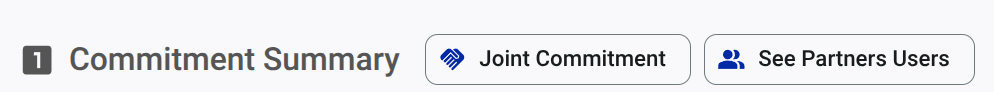
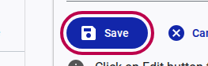
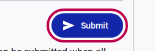

# How to Submit a Progress Report

Once you have initiated the reporting process and opened a draft report for a specific commitment, you need to fill out the required details and submit it. This guide outlines those steps.

If you prefer, you can watch a YouTube video tutorial:

<lite-youtube videoid="XK64MjjnBDY" title="How to submit a progress report" ></lite-youtube>

## Step 1: Open the Report for Editing

1. In the "Your Reports" grid, click on the row corresponding to the commitment you want to report on.
   
2. Click the **Open for Editing** button to access the full reporting form.
   
3. The form will initially be locked. Click the **Edit** button to begin making changes.
   

## Step 2: Fill Out the Report

Provide the requested information regarding the progress of your commitment.

1. **Reporting Period:** If applicable, select the specific reporting year this update covers from the dropdown menu. *(Note: For multi-year commitments, separate updates are required for each year)*.
    
2. **Commitment Status:** Choose an option from the dropdown menu that best describes the current status of your commitment (e.g., On Track, Completed, Delayed).
    
3. *(Fill in any other required textual fields detailing your progress, challenges, and successes)*.

> [!TIP]
> For **reporting on joint commitments**, it is possible to share the draft report with collaborators from other organizations to facilitate joint reporting. To do this, click the "See Partners User" button to check who can access the report. A link to share the report with collaborators is available in the "See Partners User" dialog.
> 

## Step 3: Save and Submit

1. Once you have completed the form, click the **Save** button to store your updates.
   
2. Review your saved report to ensure all information is correct.
3. When you are ready to finalize your update, click the **Submit** button.
   

Your progress report has now been submitted for the current reporting exercise.
