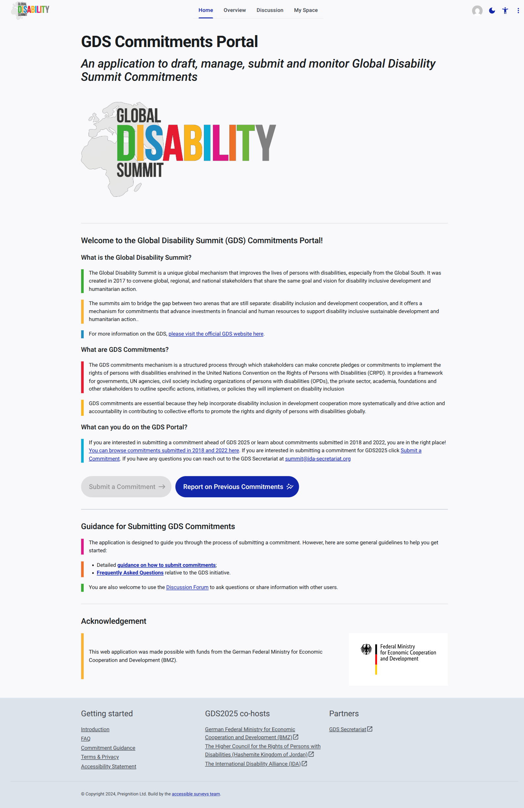
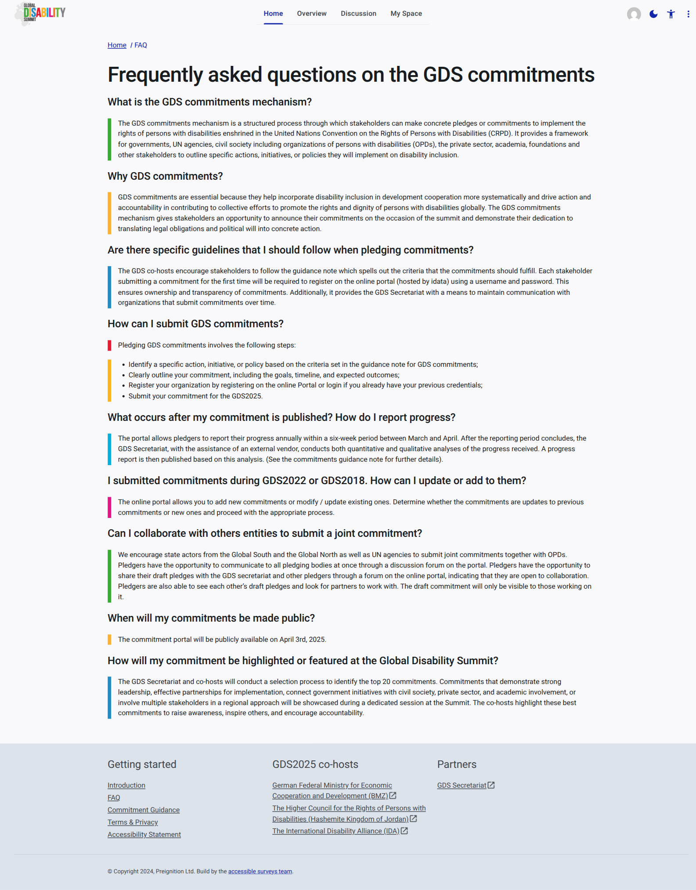
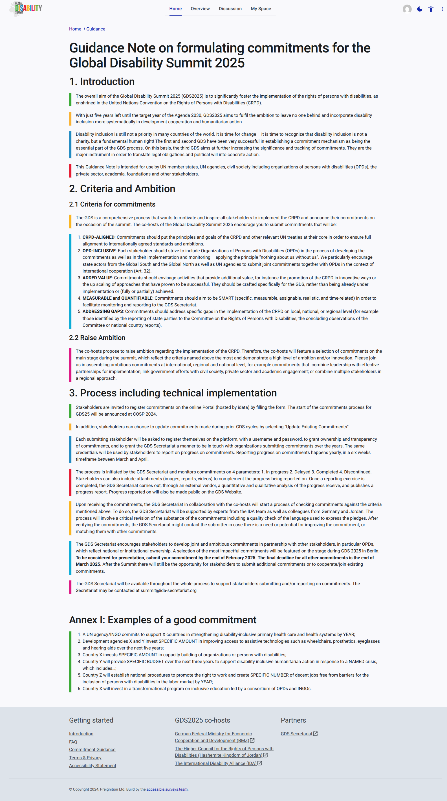

# Home

The Home section is the entry point of the GDS Portal. It provides general information about the GDS initiative and guidance on how to submit commitments.

## Welcome Page

The Welcome page serves as the starting point for users of the GDS Portal. It offers an overview of the Global Disability Summit (GDS) Initiative and provides links to key resources like commitment submission guidance and frequently asked questions.

### Key features:

- **Overview of the GDS Initiative:** Explains the aim of fostering the implementation of the rights of persons with disabilities.
- **Links to resources:** Direct access to detailed guidance and FAQs.
- **Call to action:** Links to start submitting commitments or reporting on progress (for signed-in users).

## FAQ

The Frequently Asked Questions (FAQ) page addresses common queries regarding the Global Disability Summit (GDS) initiative, the commitment process, and the portal itself. It is a valuable resource for finding quick answers to standard questions.

## Guidance

The Guidance page provides detailed information and instructions on how to submit commitments through the GDS Portal. It covers the necessary steps and provides clarity on the requirements for successful commitment submission.
