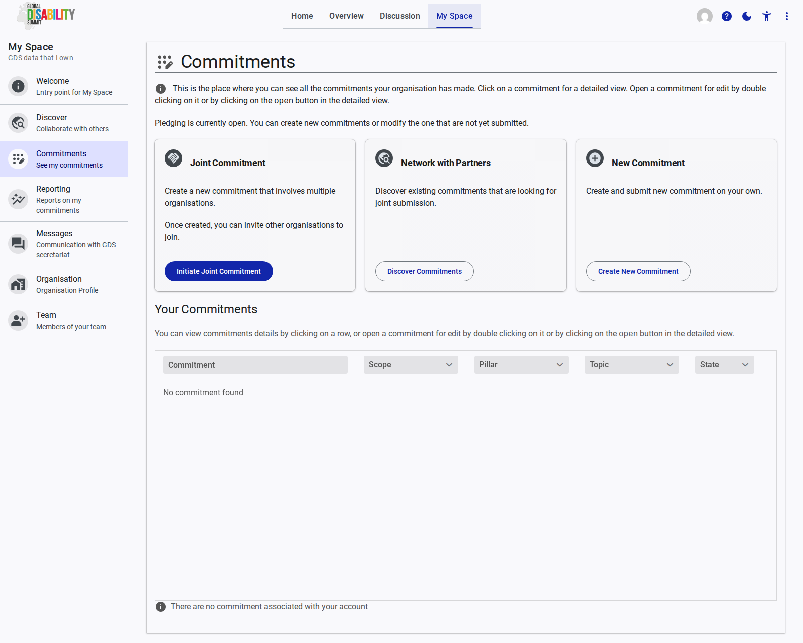

# Commitments

The **Commitments** page is the central hub for managing your organization's pledges. It provides an overview of all commitments your organization has made and offers options to create new ones.

## Overview

The main interface provides a summary of your commitments and several actions you can take, particularly when a pledging period is open.

### Creating Commitments

At the top of the page, three primary actions are available for creating or joining commitments:

1.  **Joint Commitment:** Allows you to create a new commitment that involves multiple organizations. Once initiated, you can invite other organizations to join your pledge. 
2.  **Network with Partners:** Takes you to the Discover page where you can find existing commitments that are open for joint submission.
3.  **New Commitment:** Allows you to create and submit a new, individual commitment on your own.

### Your Commitments List

The "Your Commitments" table lists all pledges associated with your account. 

*   **Columns:** The table displays key details such as the Commitment title, Scope, Pillar, Topic, and its current State (e.g., Draft, Submitted).
*   **Interactions:** 
    *   Clicking on a row opens a detailed view of the commitment.
    *   Double-clicking a row, or clicking the "open" button in the detailed view, opens the commitment for editing.

If your organization has not yet created any commitments, the table will display an empty state message: *"There are no commitment associated with your account"*.
