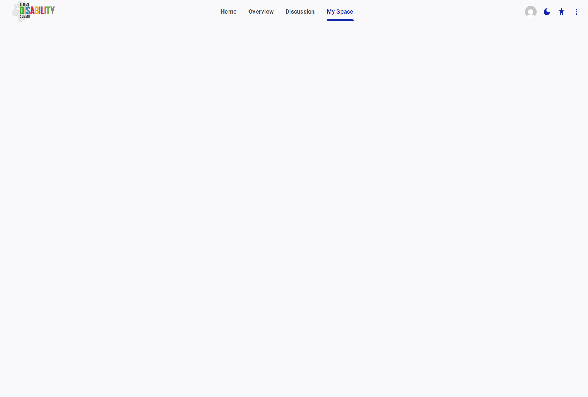

# Messages

The **Messages** section is your dedicated inbox for correspondence related to the GDS Portal.

## Overview

This page displays a log of all emails and notifications sent to your registered email address by the GDS secretariat or the portal system.

* **Message List:** The main table displays the **Date** and **Message** content for each communication.
* If you have not received any messages, the table will display an empty state indicating "No mail found" or "No message."

This centralized inbox ensures that you have a record of all official communications regarding your commitments and account status within your workspace.
