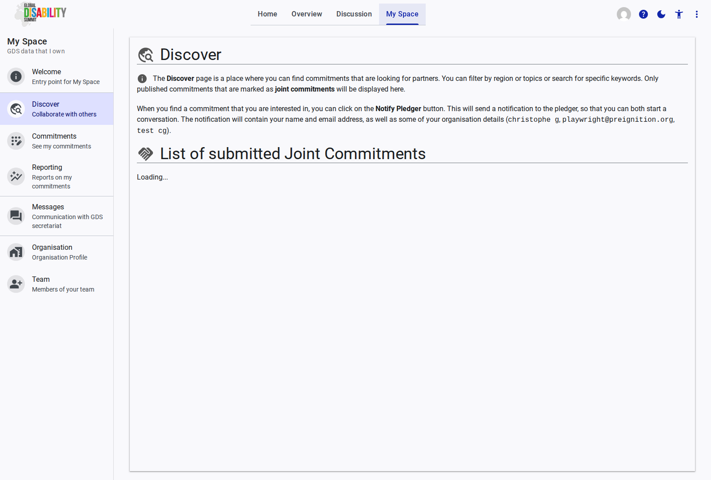
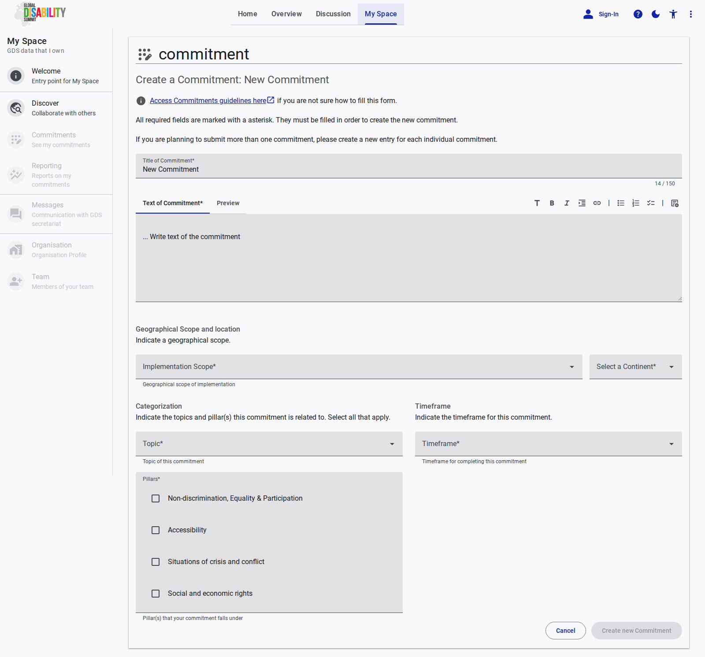
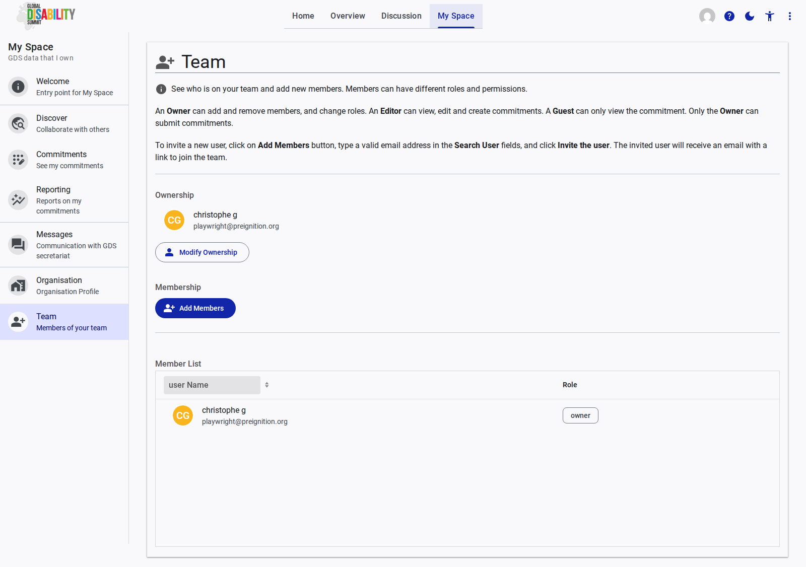

# My Space

My Space is a platform for stakeholders to manage their GDS commitments, report on progress, and collaborate with others. It provides a personalized experience for signed-in and verified accounts.

## Welcome

The Welcome page is the entry point for your personalized space on the GDS Portal. It provides quick access to core features like commitment submission and progress reporting, based on your organization profile.

[See the Welcome page reference documentation](./welcome.md) for more details on the features and interactions available on this page.

## Discover

The Discover section allows you to explore other pledges and connect with organizations for collaboration and alliance building.

[See the Discover page reference documentation](./discover.md) for more details on the features and interactions available on this page.

## Commitments

The Commitments page displays all your organization commitments. It allows you to view and manage existing pledges and initiate new ones.

[See the Commitments page reference documentation](./commitment.md) for more details on the features and interactions available on this page.

## New Commitment

The New Commitment page provides the interface for submitting new pledges to the Global Disability Summit (GDS). It allows you to enter the title, details, and relevant metadata for your commitment.

[See the New Commitment page reference documentation](./new-commitment.md) for more details on the features and interactions available on this page.

## Reporting

The Reporting page is used to report on the progress of your organization past commitments. Reporting is only available during active reporting periods.

[See the Reporting page reference documentation](./report.md) for more details on the features and interactions available on this page.

## Messages

The Messages section enables direct communication with the Global Disability Summit (GDS) secretariat for support and clarification.

[See the Messages page reference documentation](./communication.md) for more details on the features and interactions available on this page.

## Organisation

The Organisation page allows you to view and edit your organization profile, ensuring that your organization information is accurate and up to date.

[See the Organisation page reference documentation](./organisation.md) for more details on the features and interactions available on this page.

## Team

The Team page is used to manage your organization team members on the GDS Portal, allowing you to add and remove users as needed.

[See the Team page reference documentation](./team.md) for more details on the features and interactions available on this page.
