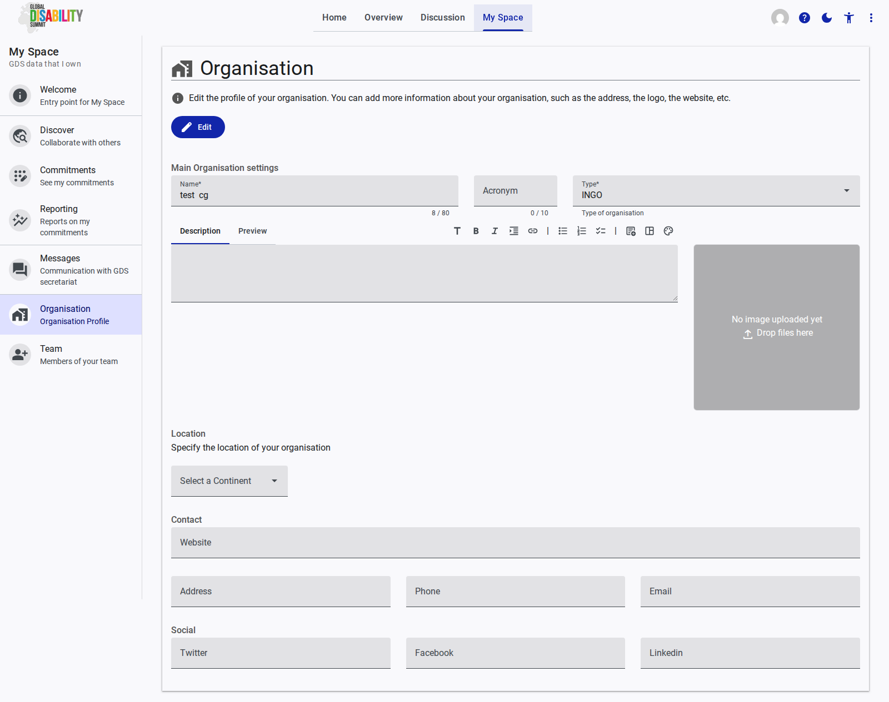

# Organisation

The **Organisation** page allows you to manage the public profile of your organization within the GDS Portal. Keeping this information accurate is crucial, as it is shared with other stakeholders, especially when initiating joint commitments.

## Editing Your Profile

To make changes, click the **Edit** button at the top of the page. The profile is divided into several sections:

### Main Organisation Settings

*   **Name:** The official name of your organization (mandatory).
*   **Acronym:** A short abbreviation of your organization's name.
*   **Type:** A dropdown to select the category that best describes your organization (e.g., INGO, Government, DPO).
*   **Description:** A rich text area to provide background information about your organization's mission and work. A "Preview" tab is available.
*   **Logo/Image:** An upload area where you can drag and drop an image file to serve as your organization's logo.

### Location

*   **Continent:** A dropdown to specify the primary region where your organization is based.

### Contact

*   **Website:** The URL of your organization's official website.
*   **Address:** Your organization's physical or mailing address.
*   **Phone:** A contact telephone number.
*   **Email:** A general contact email address for your organization.

### Social

Fields are provided to link your organization's social media profiles, including **Twitter**, **Facebook**, and **LinkedIn**.
