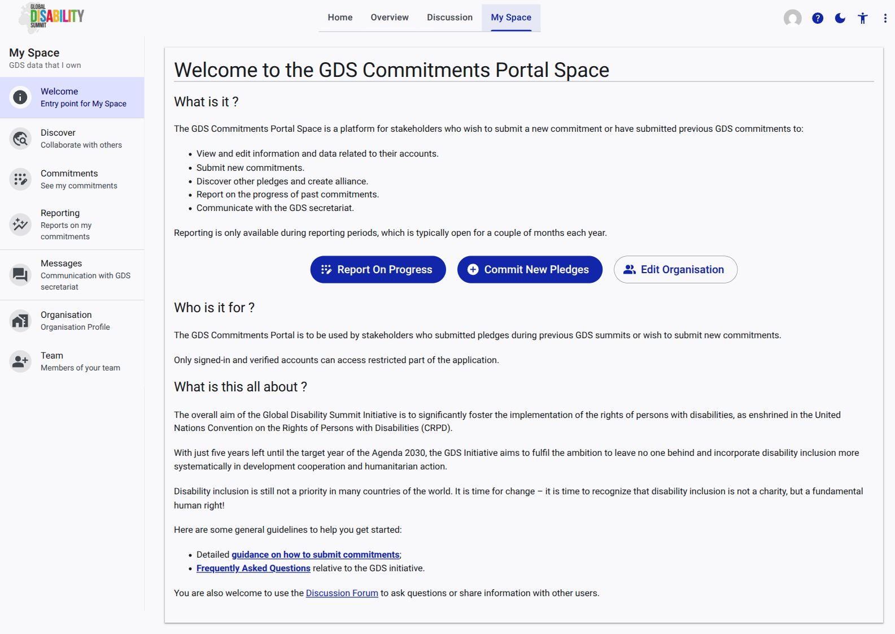

# Reporting

The **Reporting** page is dedicated to tracking and submitting updates on the progress of your organization's past commitments.

## Overview

Reporting on commitments is a crucial part of the GDS process, ensuring transparency and accountability. 

*   **Reporting Periods:** Please note that the ability to submit progress reports is typically only available during designated reporting periods, which occur for a couple of months each year.
*   **Progress Tracking:** When a reporting period is open, this page provides the interface to detail the milestones achieved, challenges faced, and overall progress against the goals set out in your original pledges.
