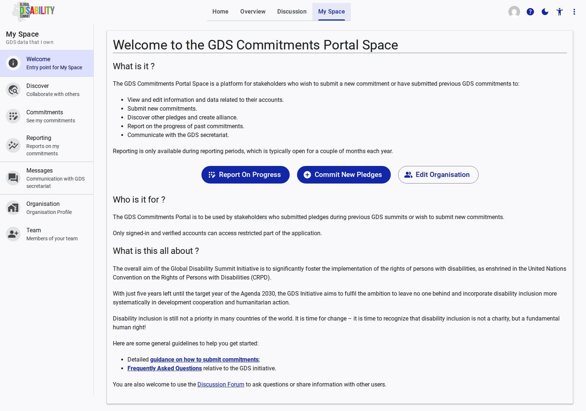

# Welcome

The **Welcome** page serves as the entry point and dashboard for your personalized Space within the GDS Commitments Portal.

## Overview

This page provides a quick summary of what the portal is, who it is for, and what actions you can take.

### Quick Actions

Depending on whether pledging or reporting periods are currently open, you will see prominent action buttons:

* **Report On Progress:** Initiates the reporting process for your existing commitments (available only during active reporting periods).
* **Commit New Pledges:** Takes you to the interface to submit new individual or joint commitments.
* **Edit Organisation:** A shortcut to update your organization's public profile and contact details.

### Information

The Welcome page also outlines the core purpose of the portal:

* **What is it?:** A platform to view and edit data, submit pledges, discover alliances, report progress, and communicate with the secretariat.
* **Who is it for?:** Stakeholders participating in the GDS initiative with verified accounts.
* **What is this all about?:** Context regarding the Global Disability Summit Initiative and its alignment with the CRPD and Agenda 2030.

It also provides quick links to detailed guidance, FAQs, and the Discussion Forum.
