# Release Notes for the initial version of the app-gds

This document describes the features in the initial version of the app-gds. [Subsequent versions will have their own release notes under](./RELEASENOTES.md).

The initial release of the application is an implementation of the [GDS Portal for Commitments 2024 Plan](https://docs.google.com/document/d/1JpHoV0DsFtPx5v8HU8yjWJi7HSgwMLeooGEgghuKxN4) document.

To monitor the progress of the development of the app-gds, please refer to the [GDS Portal for Commitments - 2024 Monitoring the execution](https://docs.google.com/document/d/1Or6VIvAYxGEdPgdOUhbOnh520tYlayILya0oNULn-4g) document.

Once the initial version of the app-gds is released, subsequent release notes will be added to the [RELEASENOTES.md](./RELEASENOTES.md) file.

## Introduction

### Overall performance

Overall Performance and conformance to standards and best practices are monitored through  [Lighthouse](https://developers.google.com/web/tools/lighthouse), with the following results:

> 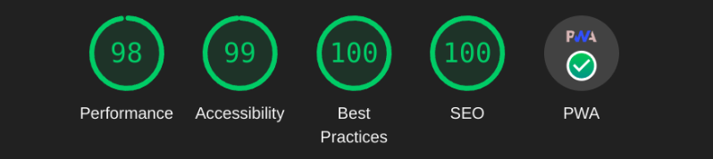
>
> Lighthouse results for the GDS Commitments Portal on 01/06/2024

### Overall App structure

> 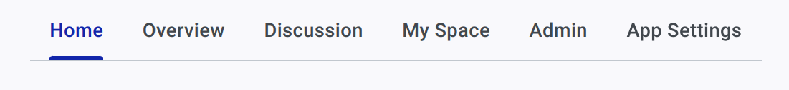
>
> Main menu of the GDS Commitments Portal

The app is structured as follows:

- [**Home Page**](/home): A landing page that introduces the GDS Portal, its purpose, and the GDS initiative, with links guiding users to the different sections of the app.
  - [**FAQ**](/home/faq): A section that provides answers to frequently asked questions about the GDS Portal and the GDS initiative.
  - [**Guidance**](/home/guidance): Guidance on how to commit quality pledges.  
  - [**Terms and Privacy**](/home/terms): The terms and conditions that users agree to when using the GDS Portal
  - [**Accessibility Statement**](/home/a11y): The accessibility statement for the GDS Portal
- [**API Docs**](/docs): A page that provides information about the API used by the GDS Portal
- [**Login**](/login): a page for logging in to the GDS Portal
- [**Overview**](/overview):  Overview of the commitments, with a search and filter feature. This page is public and accessible to anyone - deployed the previous version of similar page - yet to be developed
- [**Discussion**](/discussion): a forum where pledging bodies can discuss, ask questions, and look for collaboration
- [**My Space**](/space): main entry-point for pledging bodies
  - [**Welcome**](/space/welcome): a welcome page for pledging bodies,
  - [**Discover**](/space/discover): a page for discovering pledges looking for partners and collaborators
  - [**Commitments**](/space/commitment): a page for managing user commitments and making new ones
  - [**Reporting**](/space/report): a page for reporting on the progress of commitments
  - [**Messages**](/space/messages): a page for managing communication with the GDS secretariat
  - [**Organization**](/space/organization): a page for managing the organization's profile
  - [**Team**](/space/team): a page adding removing and managing team members
  - [**User Profile**](/space/profile): a page for managing user profile - yet to add
- [**Admin**](/admin): a page for managing the GDS Portal only available to authorized users (GDC secretariat and co-hosts), including user management, content moderation, and analytics
  - [**Welcome**](/admin/welcome): a welcome page for the admin section
  - [**Commitments**](/admin/commitment): a page for managing commitments, including reviewing and approving commitments
  - [**Reports**](/admin/report): a page for managing reports, including reviewing and approving reports
  - [**Organizations**](/admin/organization): a page for managing organizations (organization profiles, contacts, etc.)
  - [**My Tasks**](/admin/task): a page for managing tasks assigned to co-hosts, for instance reviewing commitments and reports when they are submitted
- [**App Settings**](/settings): a page for managing the all GDS settings
  - [**Welcome**](/settings/welcome): a welcome page for the app settings section
  - [**User Management**](/settings/user): a page for managing users, including inviting users to join the GDS Portal and managing user roles and permissions, or assign ownership for teh main app.
  - [**Request Access**](/settings/request): a page for overseeing requests for access to the GDS Portal (for instance, when a user requests access to an organization)
  - [**Active Settings**](/settings/settings): a page for opening or closing pledging or reporting periods.
  - [**Summits**](/settings/summit): a page for managing GDS summits, including setting the date, location, and marking the last summit as the active one
  - [**Reporting**](/settings/reporting): a page for managing reporting periods, including  adding new reporting periods or marking the active reporting period
  - [**Mail Templates**](/settings/template): a page for managing email templates, including mails with call to action.
  - [**Labels**](/settings/label): a page for managing labels, including adding new labels or editing existing ones. Labels are used to categorize commitments or organisations reports.
  - [**Reviewing**](/settings/reviewing): a page for managing user allowed to review commitments and reports
  - [**Guidance**](/settings/guidance): Guidance notes for the GDS Application
  - [**Release Notes**](/settings/release): Release notes for the GDS Application - this document
  - [**API Docs**](/docs): link to the API documentation
- **Interactive Guide**: an interactive guide to help users navigate through the app. The guide can be activated by hitting the `F1` key or clicking on the `help` icon top-right.

### Structure of this document

This release notes will follow the structure of the application itself. Each section will describe the features and improvements made to the corresponding section of the application.

### Overall Features a application level

- **Dark Mode**: The app supports dark mode, which can be toggled on or off by the user.
- **Accessibility Menu**: The app includes an accessibility menu that allows users to adjust the font size, contrast, and other settings to improve accessibility.
- **Responsive Design**: The app is designed to be responsive and accessible on a variety of devices, including desktops, tablets, and mobile phones. Menus are collapsible on mobile devices.
- **Breadcrumb Navigation**: The app includes breadcrumb navigation to help users keep track of their location within the app for sub pages.

### State charts and state machines

Some process required for the app are complex, with different stakeholders intervening at different stages of the lifecycle of objects (commitments, reports, etc.), with different roles and permissions. Views representing the objects are dynamic and change based on the state of the object and the role of the user.

To help design, develop, test, maintain, document and run these processes, we have integrated a [state chart library](https://stately.ai) into the core of the app.

Processes can be simulated, tested, and visualized in this release notes. The example below illustrate a very simple process (traffic light). Application processes like commitment lifecycle, review process, etc. are more complex and involve multiple states and transitions. They are presented later on in the release notes and can also be simulated.

> <iframe  loading="lazy" style="aspect-ratio: 6 / 3;" src="https://stately.ai/registry/editor/embed/fa443471-b416-4014-8e6f-12417863e4d4?machineId=27e86036-f2f7-40f1-9d1e-66ce6e1accc0&colorMode=light"></iframe>
>
> State chart for a very simple process (traffic light). The process can be simulated, with the different states and transitions being highlighted as the process is played.

## [API docs](/docs)

The API docs page provides information about the API used by the GDS Portal. The page includes a list of endpoints, with descriptions of each endpoint, the parameters required, and the responses returned.

The API can be tested directly from the API docs page. Users can enter the required parameters and click a button to send a request to the API. The response is displayed on the page.

> 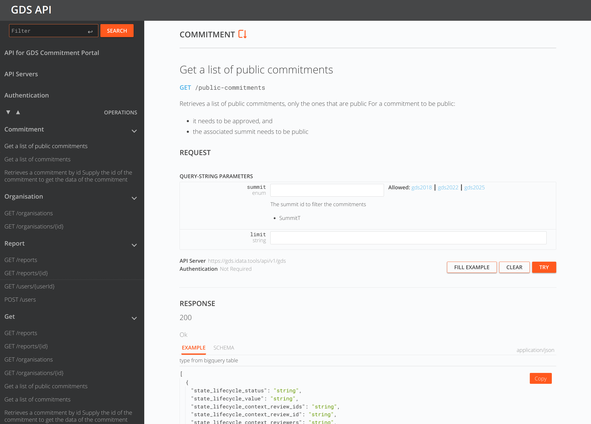
>
> Screenshot of the API docs page, with a list of endpoints and descriptions of each endpoint.

## [Home Page](/home)

This page is available to anyone. It introduces the GDS Portal, its purpose, and the GDS initiative. The page includes links to the different sections of the app, including the FAQ, guidance, terms and privacy, and accessibility statement.

The GDS logo and color scheme is integrated into the application to align with the branding of the GDS initiative.

Important actions (like `submitting a commitment`) are highlighted on the home page to encourage users to engage with the app.

When relevant, the app includes a footer with main links, and partners.

> 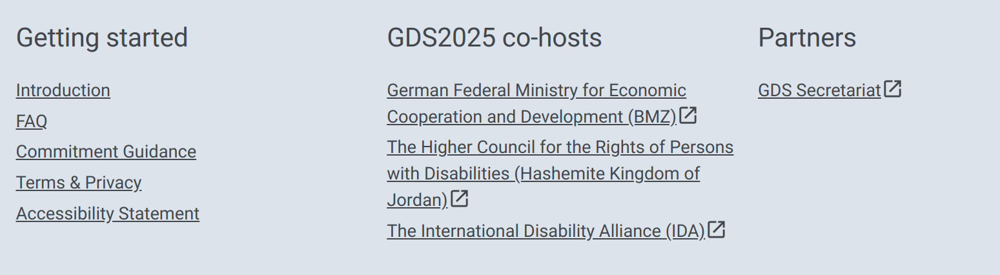
>
> Footer, visible of home page and sub-pages

## [Login Page](/login)

The login page is where users can sign in to the GDS Portal. Users can enter their email address and password to log in. Users can also create an account if they do not have one.

> 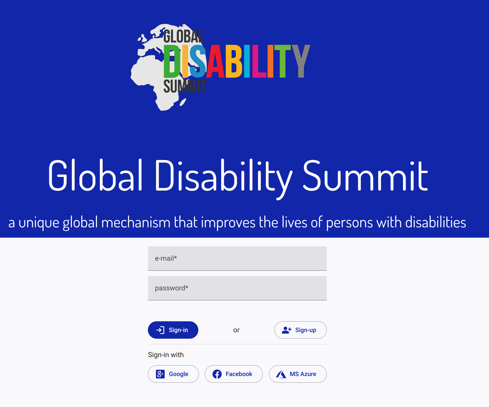
>
> Screenshot of the login page. Users can enter their email address and password to log in. Users can also create an account if they do not have one.

When users attempt to access restricted areas of the app, they are guided through an [onboarding process](#onboarding) to make sure only authorized users are accessing the app.

## [Overview Page](/overview)

This page is a public page (available to anyone) that provides an overview of the commitments, with a search and filter feature.

Yet to finalize. For the moment, the page is a copy of the previous version of the app.

## [Discussion Forum](/discussion/)

The discussion forum is only available to pledging bodies and GDS co-hosts. It is a place where pledging bodies can discuss, ask questions, and look for collaboration.

Only users who have a verified email address can create a new discussion post.

This part of the app deserves its own release note. [See the release note for the discussion forum](./DISCUSSION.md)

> 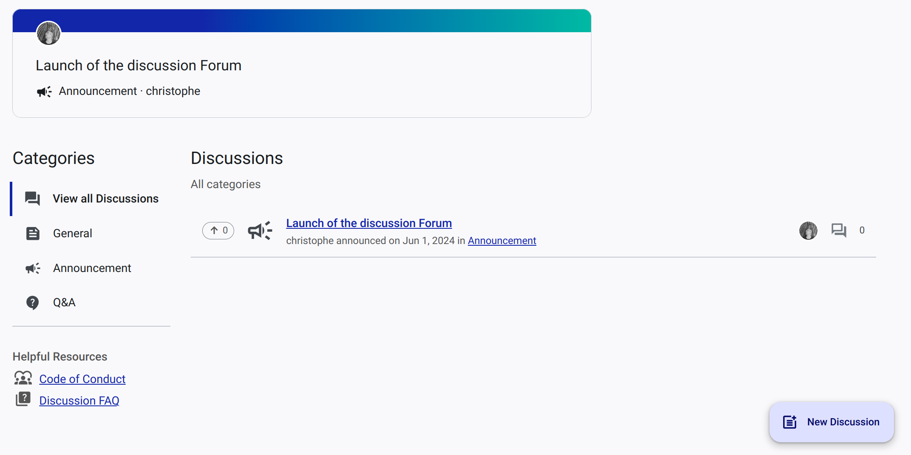
>
> Screenshot of the discussion forum

## [My Space](/space)

My Space is the main entry-point for pledging bodies. It includes several sections: Welcome, Discover, Commitments, Reporting, Messages, Organization, Team and User Profile.

> 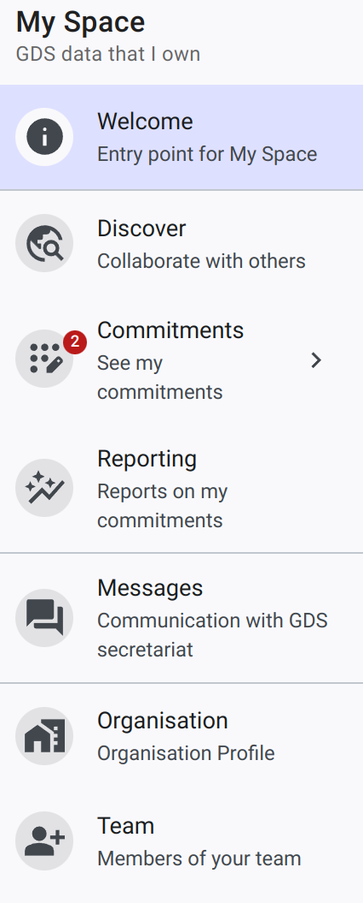
>
> Main menu of My Space

When some items like commitments or reports are opened They appear in the menu as sub-items:

> 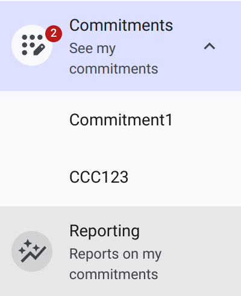
>
> Main menu of My Space, with 2 commitments opened and visible on the menu. Activating the subitem will open the corresponding page for editing.

Some pages (Welcome, Discover, Commitments) under My Space are available to anyone. Others are only available to you signed-in pledgers. When a user tries to access protected pages he/she is guided through an [onboarding process](#onboarding) to make sure only authorized users are accessing the app.

### Onboarding

When users attempts to access restricted areas of the app, a series of checks is performed to determine if the user is allowed.

First when users are not signed in, they are prompted to sign or verify if they already have an account.

> 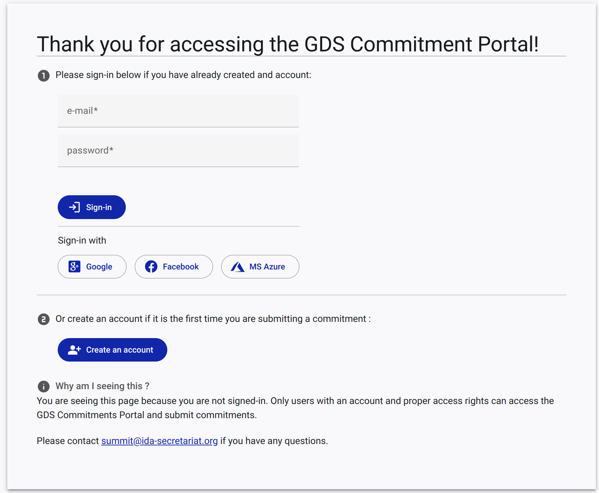
>
> Users are prompted to sign in or create an account when they attempt to access restricted areas of the app.

When a user chose to create an account, they then guided through a series of steps to ensure a smooth onboarding process:

- **Step 1**: The user is prompted to enter their email address and password;
  > 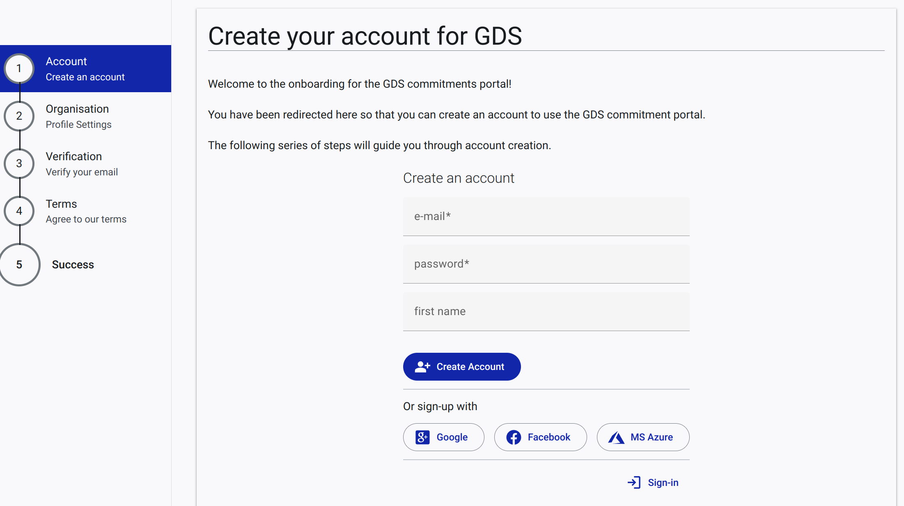

- **Step 2a**: The user is prompted to enter their organization name, type and description;
  > 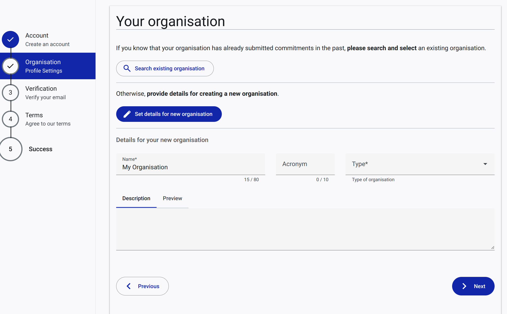

- **Step 2b**: alternatively, the user can search for an organization and request access to it;
  > 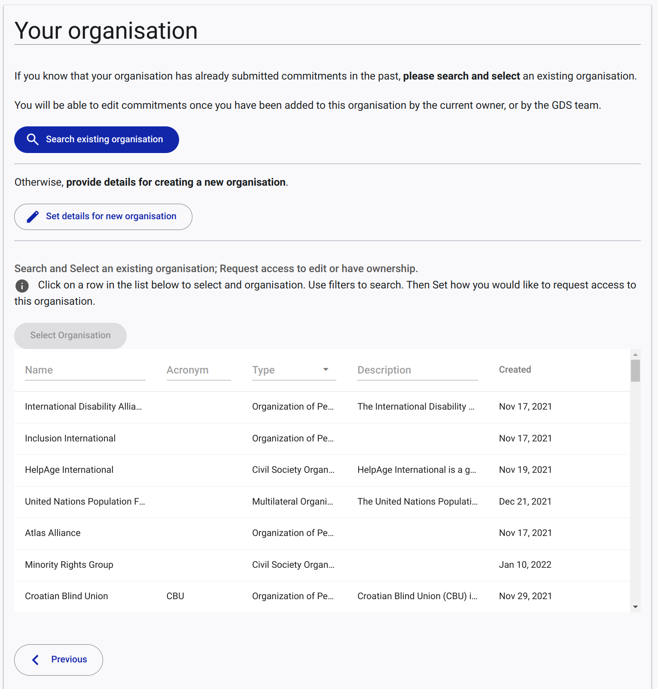

- **Step 2c**: once an existing organization is found, the user can request access to it as owner or editor. The request is sent to the current owner of the organisation and to the GDS secretariat. The user will only be able to access the organisation once the request is approved;
  > 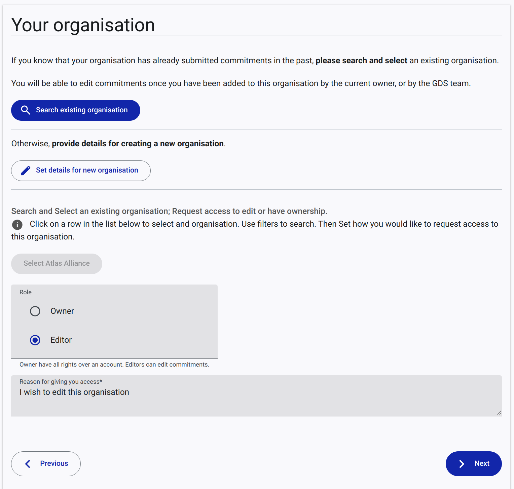

- **Step 3**: The user is prompted to validate their email address;
  > 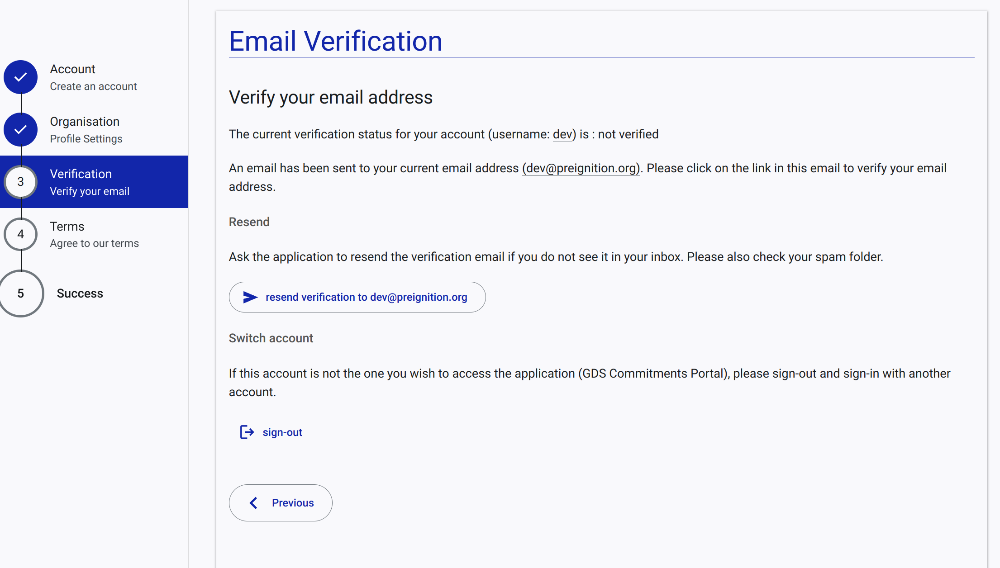

- **Step 4**: The user is prompted to sign terms and conditions.
  > 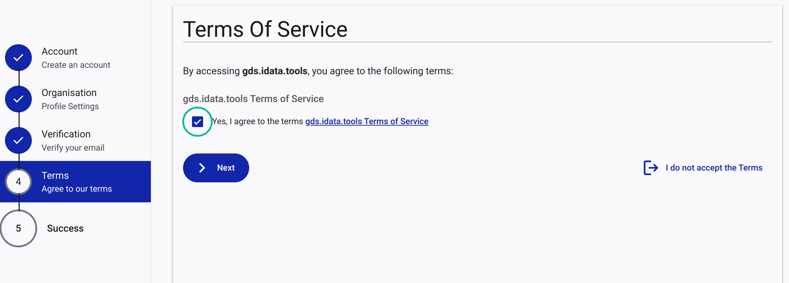

- **Step 5**: Last step, indicating that the account has been created with success.
  > 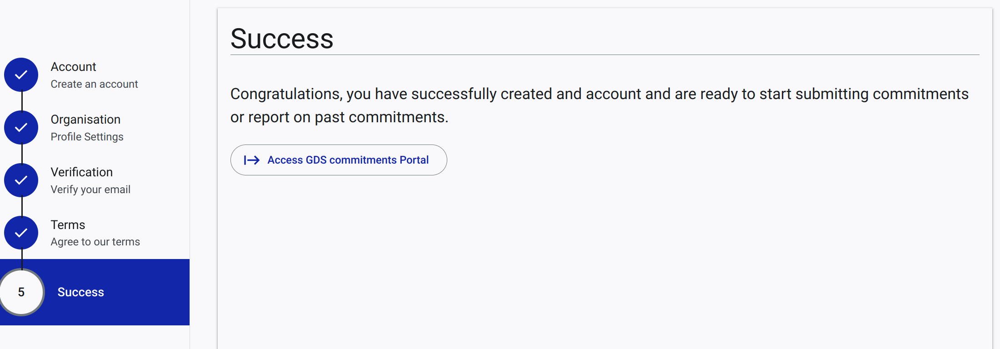

The application handles cases where a user wants to take ownership of an organization. This can occur if the organization has submitted commitments in the past, but the linked accounts are no longer in use or the ownership has changed.

When a user wants to take ownership of an organization, he/she is guided through a series of steps to ensure a smooth onboarding process:

- **Step 1**: The user is prompted to either sign-out or request ownership when trying to access the detail page of an organization he/she is not part of.
  > 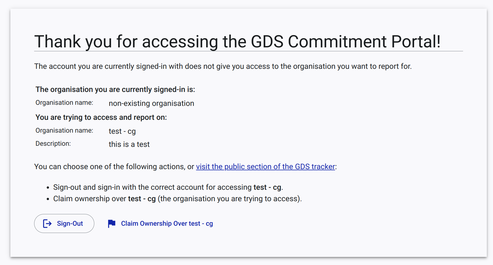

- **Step 2**: The user can request ownership over the organization by clicking on the `Request Ownership` button. The request is sent to the current owner of the organisation and to the GDS secretariat.
  > 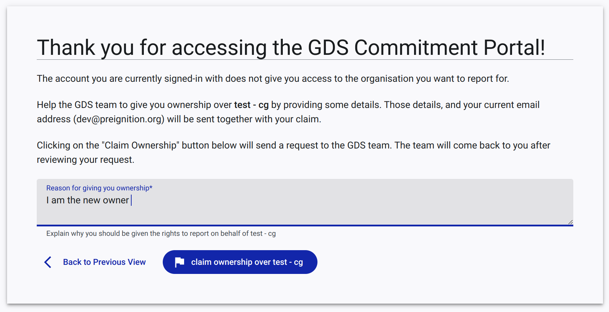

### Welcome Page

The Welcome page is the first page users see when they access My Space. It is visible to anyone and provides an overview of available actions and information.

When Pledging is open the page includes a call to action to submit a commitment.

When reporting is open the page includes a call to action to submit report reports.

> 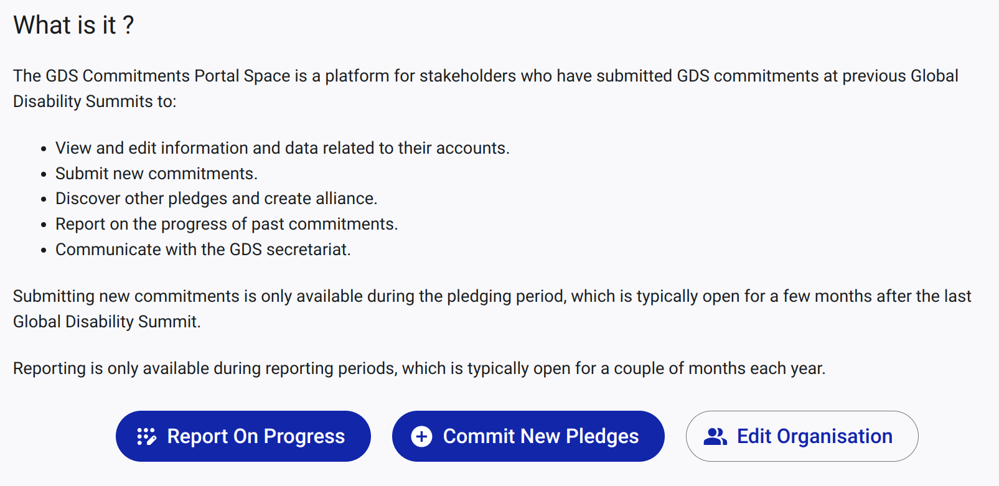
>
> Screenshot of the Welcome page, with call to action to submit a commitment or a report.

### Discover Page

The Discover page is a public page that allows users to discover pledges looking for partners and collaborators. It includes a search and filter feature to help users find relevant pledges.

Signed-in users can notify the pledger based on the commitment they are interested in.

Note that this page is only partially developed.

> 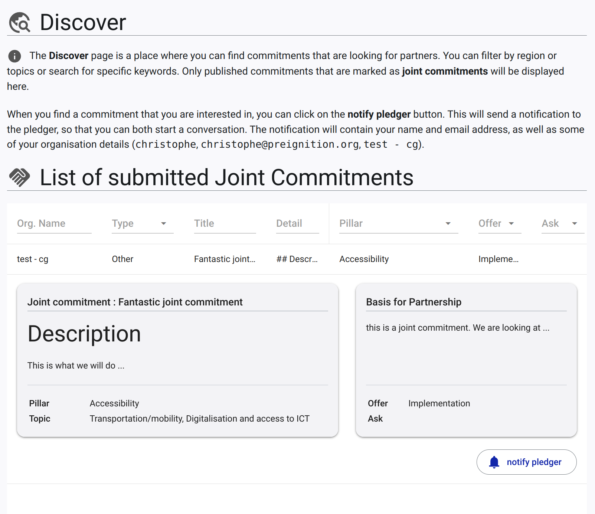
>
> Screenshot of the Discover page, with a list of commitments looking for partners. The page includes a search and filter feature to help users find relevant pledges.

### Commitments Page

The Commitments page is where users can manage their commitments and make new ones. Users can view, edit, and delete their commitments, as well as create new commitments (when a pledging period is open).

This page is only available to signed-in users who have created an account.

> 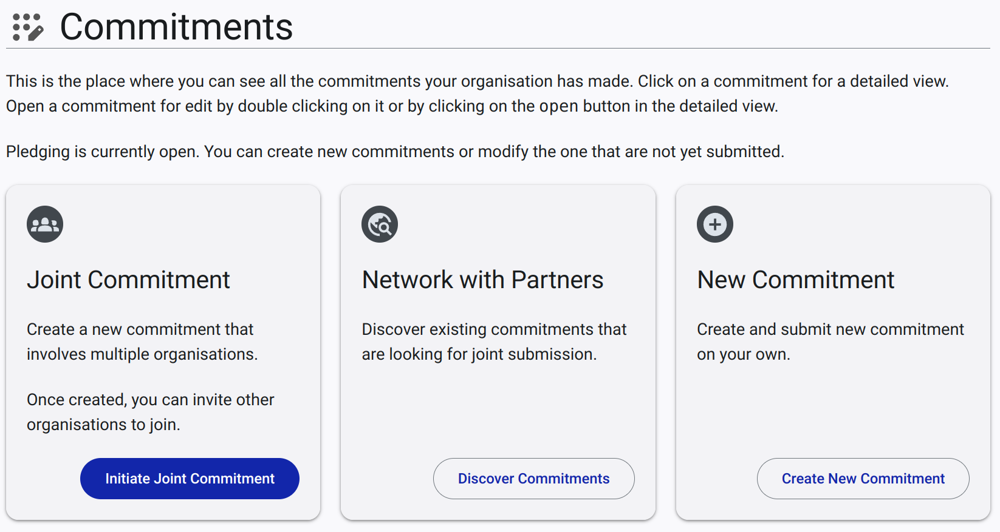
>
> Screenshot of the Commitments page, with actions to create a `joint commitment`, `Network with Partners` or `create a new commitment`.

#### Regular commitments

Clicking on the `Create a new commitment` button opens a form where users can enter the details of their commitment.

> 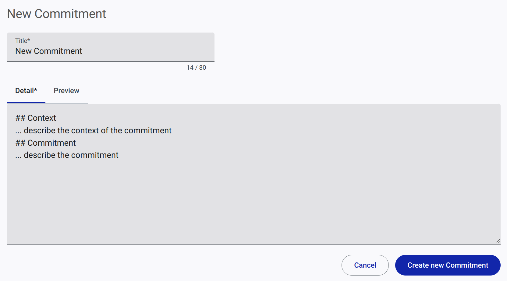
>
> Screenshot of the form to create a new commitment (Current screenshot is missing `location`, `pillars` and `topic` - to be added soon).

#### Joint commitments

Clicking on the `Initiate Joint Commitment` button initiate the creation of a new joint commitment. Joint commitments differ from regular commitments in that they are created by multiple pledging bodies working together to achieve a common goal.

In addition to regular commitment fields, the commitment form includes a `partnership` section in which the pledger indicates why and how he sees a joint commitment working. There is a narrative field for this, as well as fields to specify the offer and ask of the partners.

> 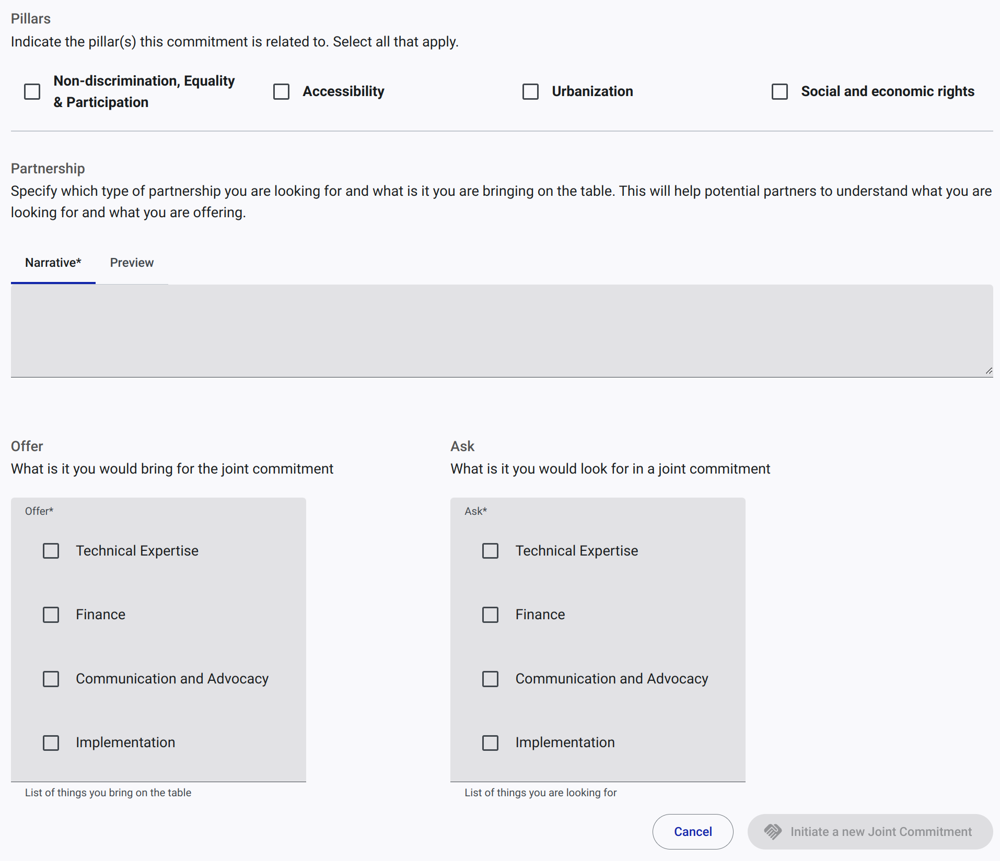
>
> Screenshot of the partnership section of the joint commitment form.

#### Network with Partners

Clicking on the `Network with Partners` button redirects the user to the Discover page where commitments looking for partners are listed and can be searched and filtered. Only users wit an account on the GDS portal can view this list.

Commitments can be filtered by organisation (`name` and `type`), by `text` contained in the commitment, by commitment `ask` and `offer`, by `pillar` and `topic`.

Clicking on a commitment opens a detailed view of the commitment, with the option to notify the pledger and start a conversation with him/her.

> 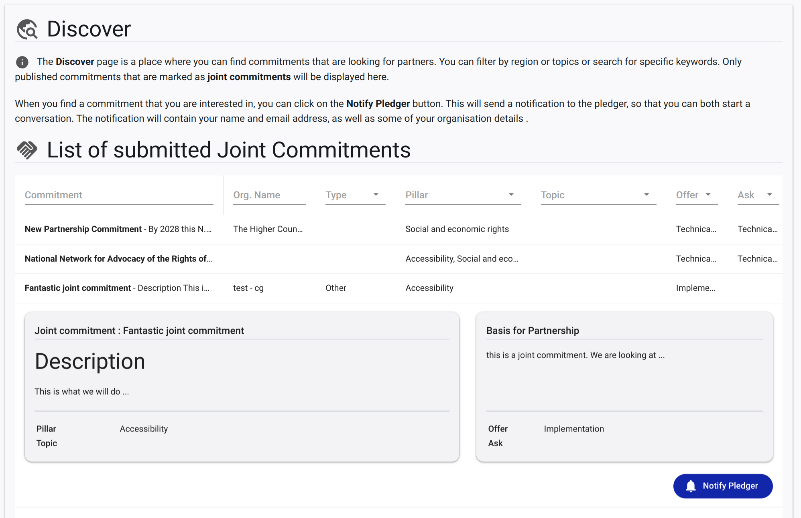
>
> Screenshot of the list of open joint commitments. The list can be filtered by organisation, text, ask, offer, pillar, and topic. Clicking on a commitment opens a detailed view of the commitment, with the option to notify the pledger and start a conversation with him/her.

#### Creating Partnerships for joint Commitments

For a joint commitment to accept new partners, both the owner of the commitment and the new partner must agree to the partnership. The way this process works is as follows:

- **Step 1**: Any user of the GDS portal can notify the owner of a joint commitment that he/she is interested in the commitment by clicking on the `Notify` button and entering a message explaining why he/she is interested in the commitment.
  > 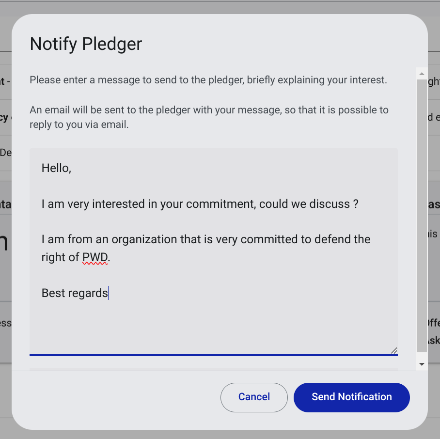

- **Step 2**: The owner of the commitment receives a notification with the user's contact details and the message. A conversation can be started between the owner and the user via email as they now both have each other's contact details.
  > 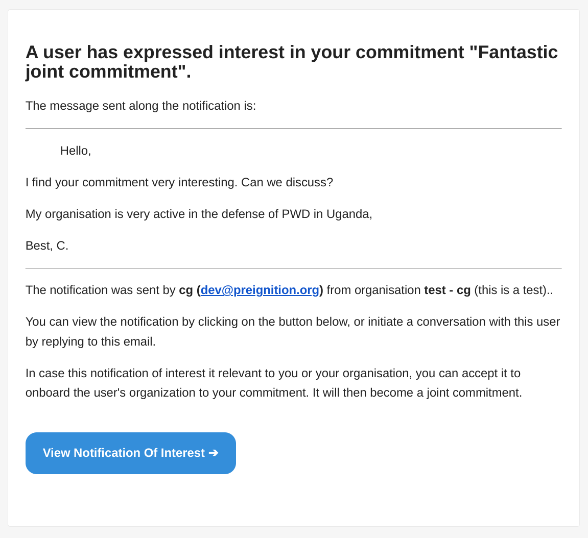

- **Step 3**: The owner of the commitment can accept or reject the partnership.
  > 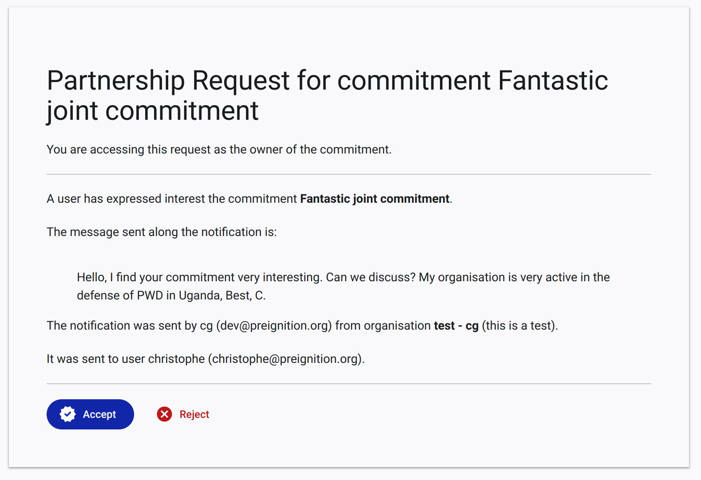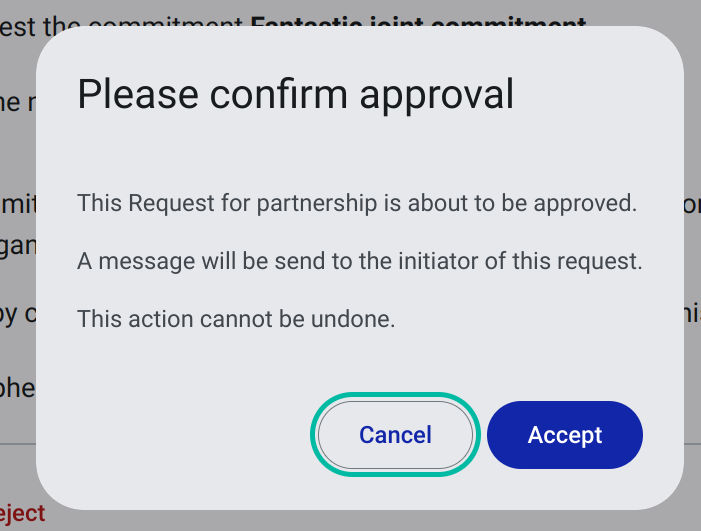

- **Step 4**: The initiator of the request is notified of the owner's decision.
  > 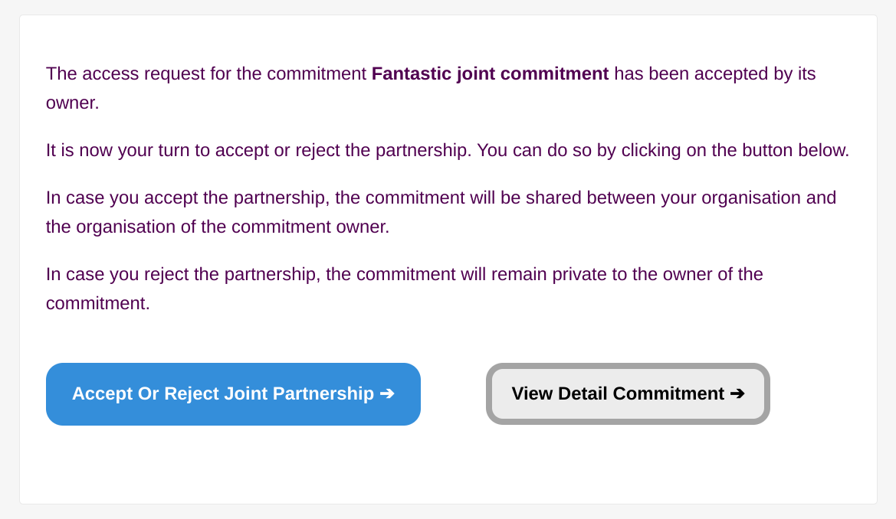

- **Step 5**: The initiator of the request accept or reject the partnership.
  > 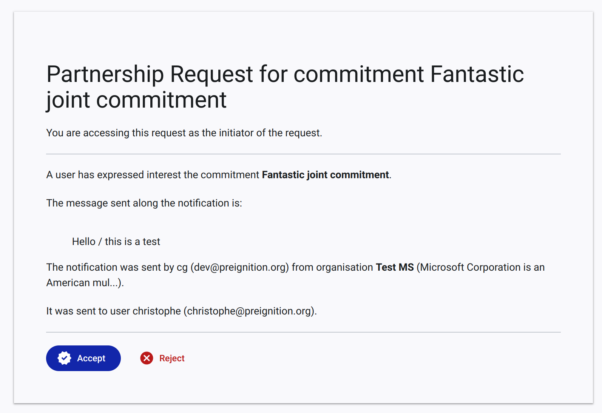

- **Step 6**: Both parties are notified of the final decision. If both parties have accepted the partnership, it is now active.
  > 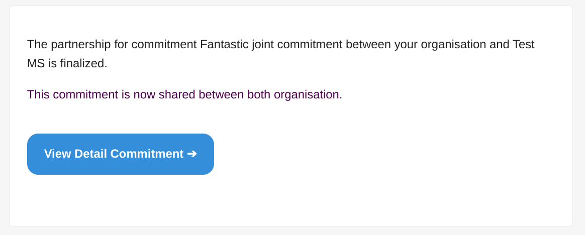

Active partnerships are listed in the partnership section of the joint commitment form, with a dedicated field to explicit the role of each partner:

> 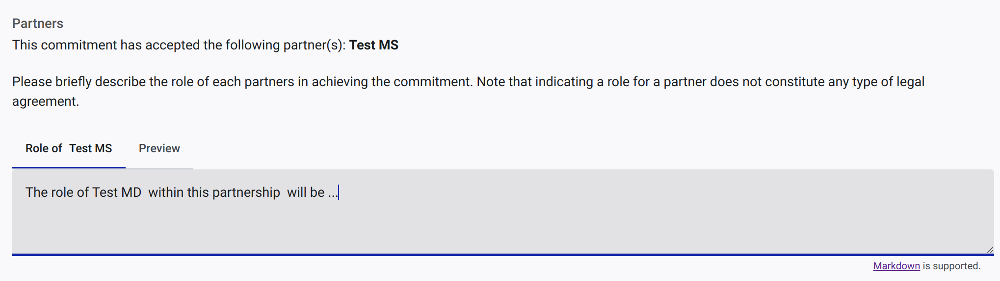
>
> Screenshot of the partnership section of the joint commitment form, with a list of active partnerships. Each partnership includes the role of the partner.

Open Partnership requests are displayed in the commitment detail page, with the option to accept or reject the partnership here as well.

> 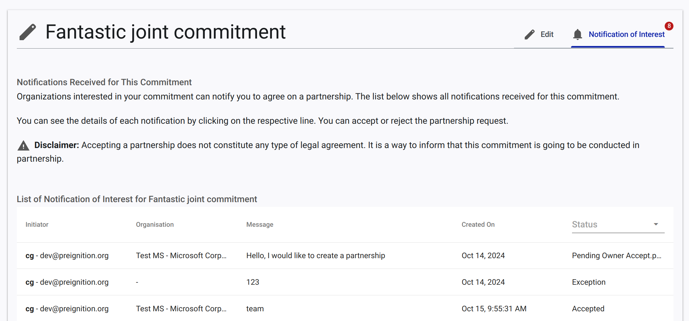
>
> Screenshot of the partnership section of the joint commitment form, with a list of open partnership requests. Each request includes the role of the partner and the option to accept or reject the partnership.

Administrators of the GDS app also have a way to manage partnerships. They can view a list of all partnerships, with the option to accept or reject partnerships ([see the request access section](#request access)).

The state chart of this process is presented below:

> <iframe  loading="lazy" style="aspect-ratio: 6 / 3;" src="https://stately.ai/registry/editor/embed/e0e66cd7-dfc0-4140-a3d9-61e90b1b133e?machineId=07f3b2b3-fe21-4379-b969-77c2bd62334&colorMode=light"></iframe>
>
> State chart for the partnership creation process. The process can be simulated, with the different states and transitions being highlighted as the process is played.

When a user is interested in a commitment, he/she can notify the pledger. The pledger will receive a notification with the user's contact details and a message.

### Editing commitments

Pledgers can also view the list of their commitments, with the status of each commitment (e.g., draft, submitted, approved, rejected) on the main commitment page:

> 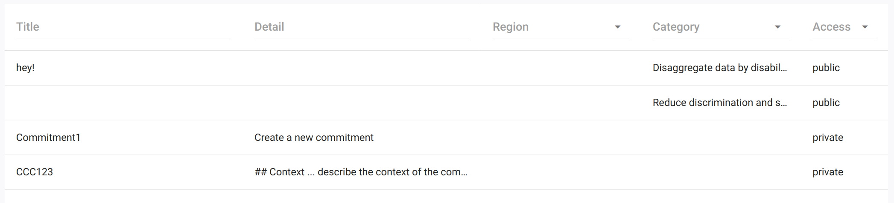
>
> Screenshot of the list of commitments, with the status of each commitment (details of attributes to display still to finalize). Clicking on a row opens a detailed view of the commitment. It is also possible open a commitment for editing (before commitment submission).

Editing a commitment opens a form where users can edit the details of their commitment, and save the changes:

> 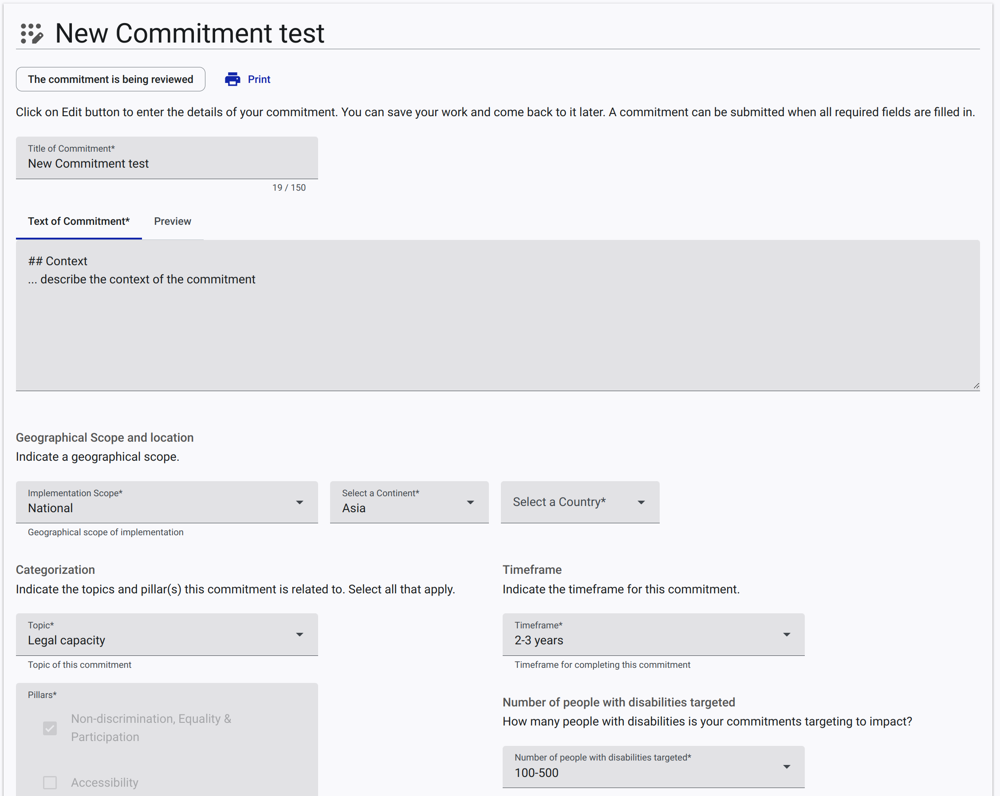
>
> Screenshot of the form to edit a commitment. Users can edit the details of their commitment and save the changes. In addition the `title` and `detail` field, the form includes `location`, `pillars` and `topic` fields.

Pledger can edit a commitment as long as the commitment is in `draft` state. Once the commitment is submitted, it can no longer be edited. The pledger can only view the commitment and the status of the commitment. The status of the commitment is displayed at the top of main commitment page.

> 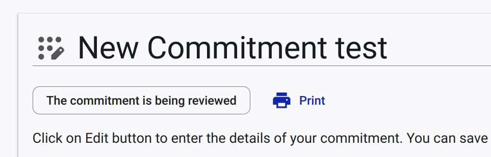
>
> Screenshot of the status of a commitment. The status of the commitment is displayed at the top of the main commitment page.

### Printing commitments

Users can print their commitments by clicking on the `Print` button. The commitment is displayed on a new tab in a print-friendly format, with the option to print or save the commitment as a PDF.

> 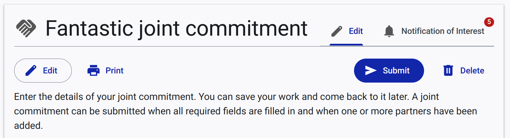
>
> Screenshot of the print button on the commitment page. Clicking on the button opens a print-friendly version of the commitment.

> 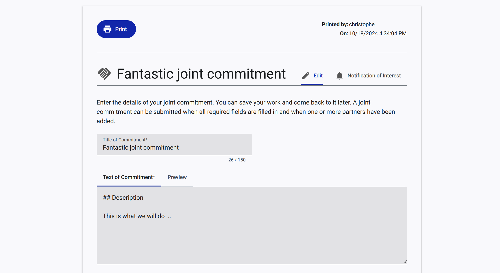
>
> Screenshot of the print view of a commitment. The commitment is displayed in a print-friendly format, with the option to print or save the commitment as a PDF.

### Reporting Page

The Reporting page is where users can report on the progress of their commitments. Users can view, edit, and delete their reports, as well as create new reports (when a reporting period is open). This page is only available to signed-in users who have created an account.

Yet to be developed.

### Messages Page

The Messages page is where users can manage communication with the GDS secretariat. Users can view messages they have received in the context of teh application (message from the GDS secretariat, invite request, or other pledger notifying them). This page is only available to signed-in users who have created an account.

> 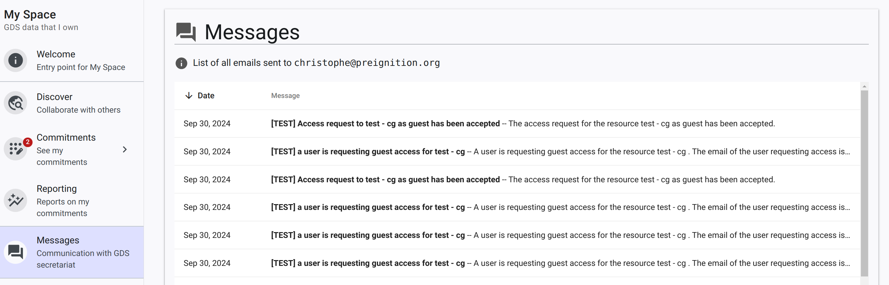
>
> Screenshot of the Messages page, with a list of messages received by the user.

### Organization Page

The Organization page is where users can manage the organization's profile. Users can view, edit, and delete the organization's profile. This page is only available to signed-in users who have created an account.

> 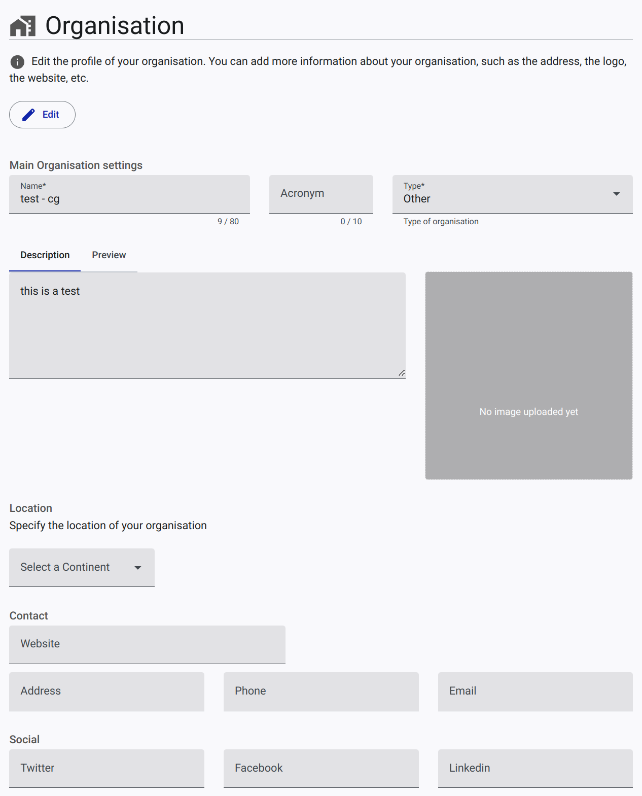
>
> Screenshot of the Organization page, with actions to edit the organization's profile. The page includes fields for the organization's name, type, description, and contacts.

### Team Page

The Team page is where users can add, remove, and manage members belonging to the same organisation, so as to give them editing rights to the organisations commitments and reports.

> 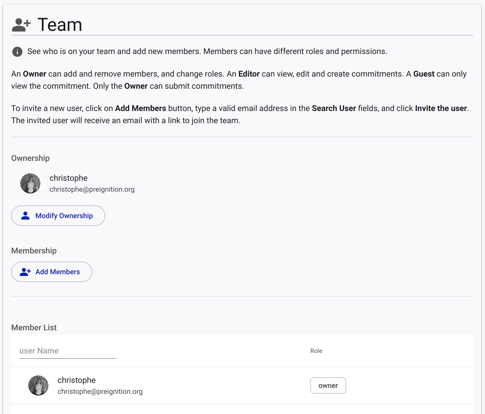
>
> Screenshot of the Team page, with a list of team members and actions to add, remove, and manage team members.

#### Invite a user to join the active organisation

It is possible to add users to join the active  organisation. When a user is invited to join the organisation, he/she receive an email with a link to create an account. The user is then added to the organisation with the appropriate permissions when the invite is accepted.

The process works as follows:

- **Step 1**: The owner of the organisation is prompted to enter the email address of the user to invite;
  > 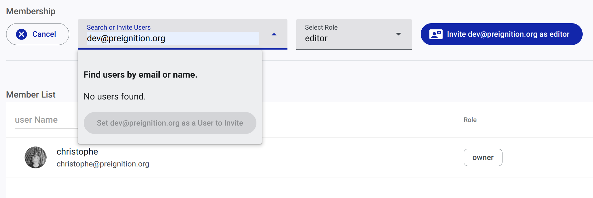

- **Step 2**: A new `Invitations` tab appears on the team page, with the list of pending invitations.
  > 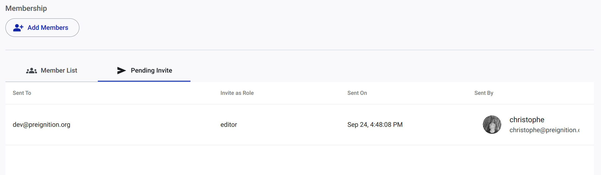

- **Step 3**: The invited user receives an email with a link to create an account.
  > 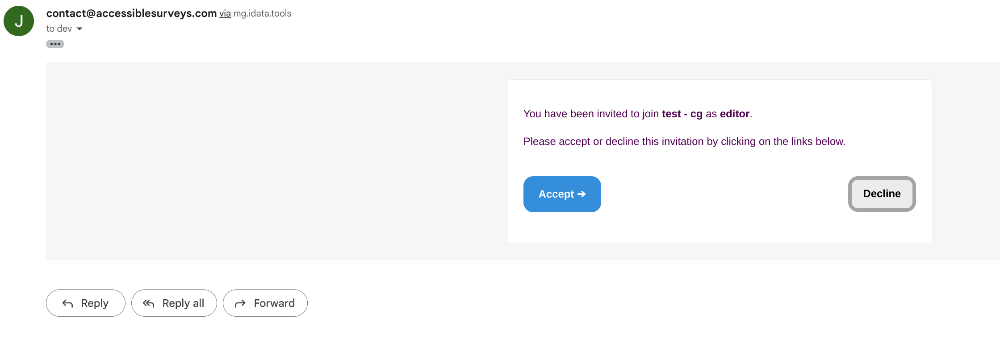

- **Step 4**: The user is guided through a series of steps to ensure a smooth onboarding process. This includes creating an account or signing-in if the user already has an account.
  > 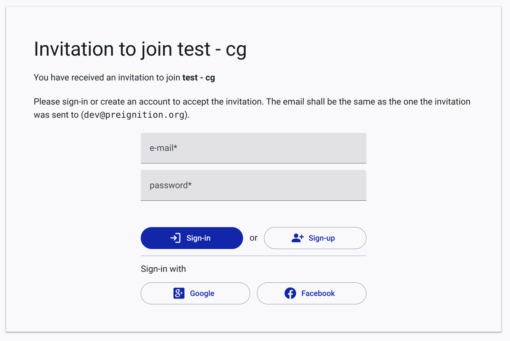

- **Step 5**: WHen the user is signed-in he/she can accept or decline the invitation. Accepting the invitation will add the user to the organisation with the appropriate permissions.
  > 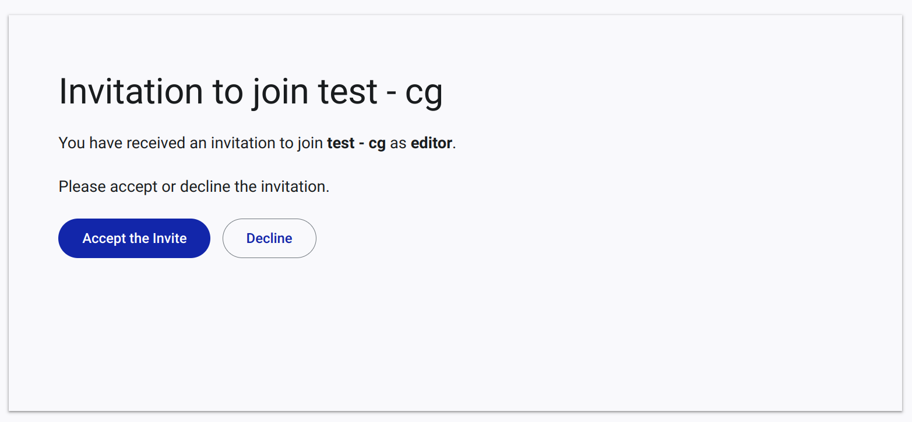

## [Admin](/admin)

The admin section is only available to authorized users (GDS secretariat and co-hosts). It is though to ease the management of commitments, commitment reviews, reports and organisations.

Overall the admin section pages follow a similar structure as the My Space section. For each entities (commitment, report, organisation), it is possible to view and filter entities in a list.

### Commitments

#### Processes involved in the Commitment Page

There are 3 process used in the Commitment page:

- the commitment lifecycle, and
- the review process.
- the task lifecycle

The commitment lifecycle is a process that manages the lifecycle of a commitment, from creation to approval by the GDS secretariat and co-hosts. The review process is a process that manages the review of commitments by the GDS secretariat and co-hosts.

The commitment lifecycle process can be played below (beware, they are rather complex and involve multiple states and transitions).

> <iframe  loading="lazy" style="aspect-ratio: 6 / 6;" src="https://stately.ai/registry/editor/embed/e0e66cd7-dfc0-4140-a3d9-61e90b1b133e?machineId=5329947c-0f37-4feb-8d1c-f9d8a5233ee00&colorMode=light"></iframe>
>
> State chart for the commitment lifecycle. The first state of a commitment is `Draft`; a commitment can then be `Submitted`, which triggers a `Review` Process. When all reviewers have marked their review as completed, the commitment can be `Approved` or `Rejected`, or the submitter can be asked to improve its commitment (`Request Change`).
> Various actions are triggered on different transitions. For instance, pledgers receive notifications when their commitment is approved or rejected, or when change is requested.

A Task process is being assigned to co-hosts to review commitments and reports when they are submitted. The task lifecycle process can be played below:

> <iframe  loading="lazy" style="aspect-ratio: 6 / 4;" src="https://stately.ai/registry/editor/embed/e0e66cd7-dfc0-4140-a3d9-61e90b1b133e?machineId=a60d418a-c6d3-48ab-b743-bdd8576a6c4b&colorMode=light"></iframe>
>
> Task lifecycle. The review process is completed when all reviewers have marked their review as completed. The task can then be `Approved` or `Rejected`, or the submitter can be asked to improve its commitment (`Request Change`).

### List view of commitments

The list view of commitments includes a search and filter feature to help users find relevant commitments. Co-host can filter commitments by status (e.g., draft, submitted, approved, rejected), by pledging body, by date, and by other criteria.

> 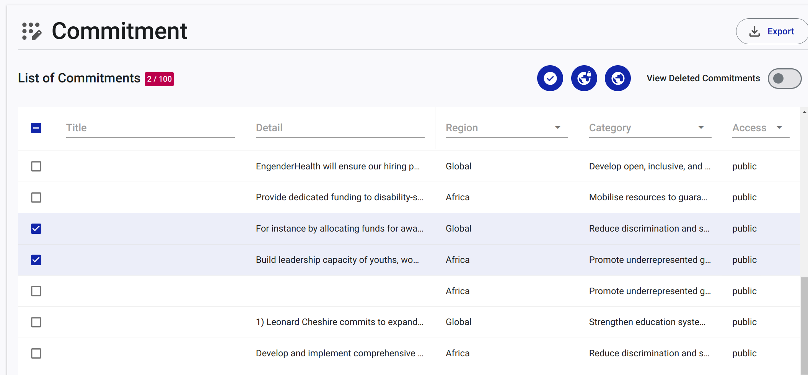
>
> Screenshot of the list view of commitments, with search and filter feature. Additional action appear when commitments ar selected in order to activate bulk actions (like send messages to pledgers).

### Reviewing Commitments

When a commitment is submitted, a review process is triggered. Co-hosts can review the commitment and mark their review as completed when it is done.  Once all reviews are completed, the user in charge of the review process can approve or reject the commitment. He/she can also request changes to the commitment, which will trigger a new review process.

In addition to fields filled-in by the pledger, the review page includes a section for reviewers to add comments and mark the review as completed or to apply [labels](#labels) to the commitment.

Each reviewer can add its comment on a commitment and give an overall score to the commitment. The score is used to calculate the overall score of the commitment.

> 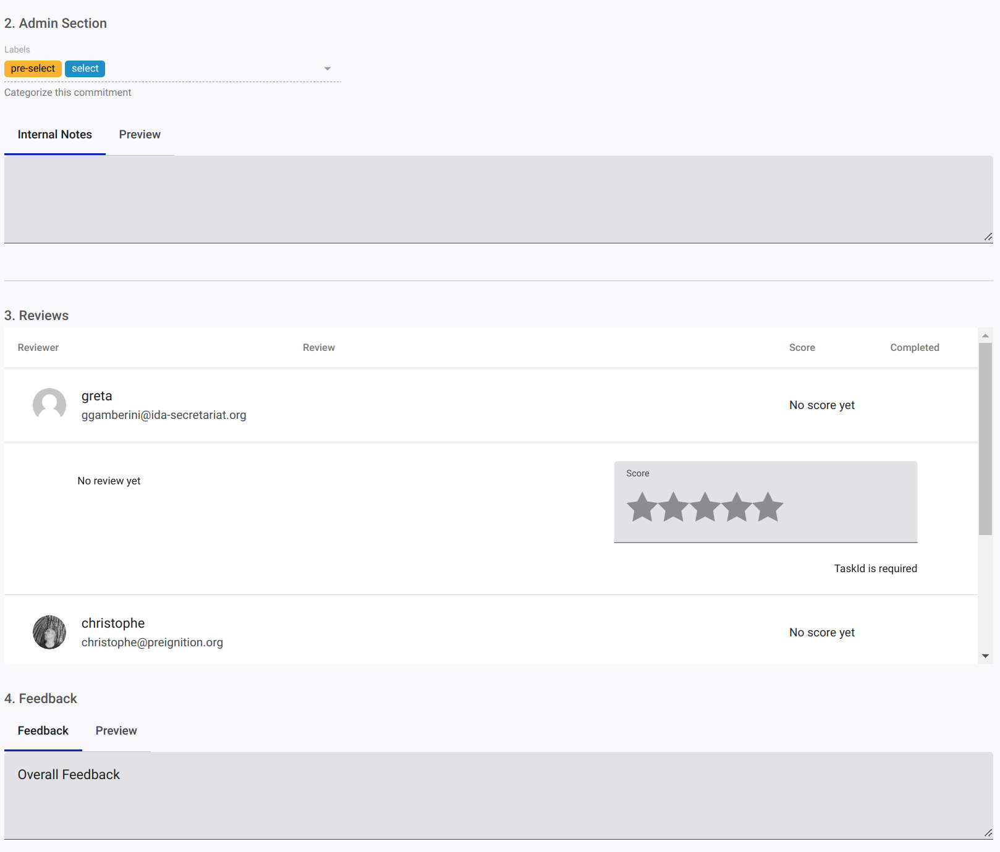
>
> Screenshot of the review page for a commitment. Reviewers can add comments and mark the review as completed. Labels can be applied to the commitment. An overall score is calculated based on the scores given by the reviewers. A feedback can also be added; it will be send to the pledger when the commitment is either approved, rejected or when changes are requested.

Available actions appear on the top right of the commitment, depending on the status of the commitment and the role of the user. For instance, when a commitment is submitted, the actions to review the commitment appear. When the commitment is reviewed, the actions to approve, reject, or request changes to the commitment appear.

> 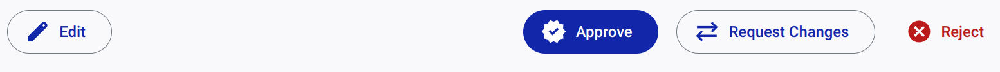
>
> Example of actions available on a commitment (which has been reviewed).

### My Tasks

The My Tasks page is where co-hosts can manage tasks assigned to them, for instance reviewing commitments and reports when they are submitted. Co-hosts can view, reply to, and delete tasks. This page is only available to signed-in users who have created an account.

Tasks are automatically assigned to co-hosts when depending on the role of the co-hosts and the status of the commitment or report. For instance, when a commitment is submitted, a task is assigned to co-hosts to review the commitment.

> 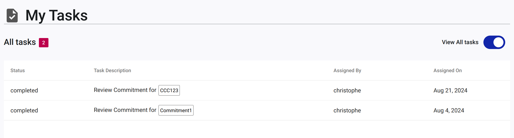
>
> Screenshot of the My Tasks page, with a list of tasks assigned to the co-host. Task owner can view, reply to, and delete tasks. Viewing the task will open the relevant commitment or report for review.

## [App Settings](/settings)

The App Settings section is only available to authorized users (GDS secretariat can edit, co-hosts can view). It is a place where the GDS settings can be managed.

### Welcome

A very simple plage welcoming users to the settings section.

### User Management

The User Management page is where users can manage users, including inviting users to join the GDS Portal and managing user roles and permissions.

> 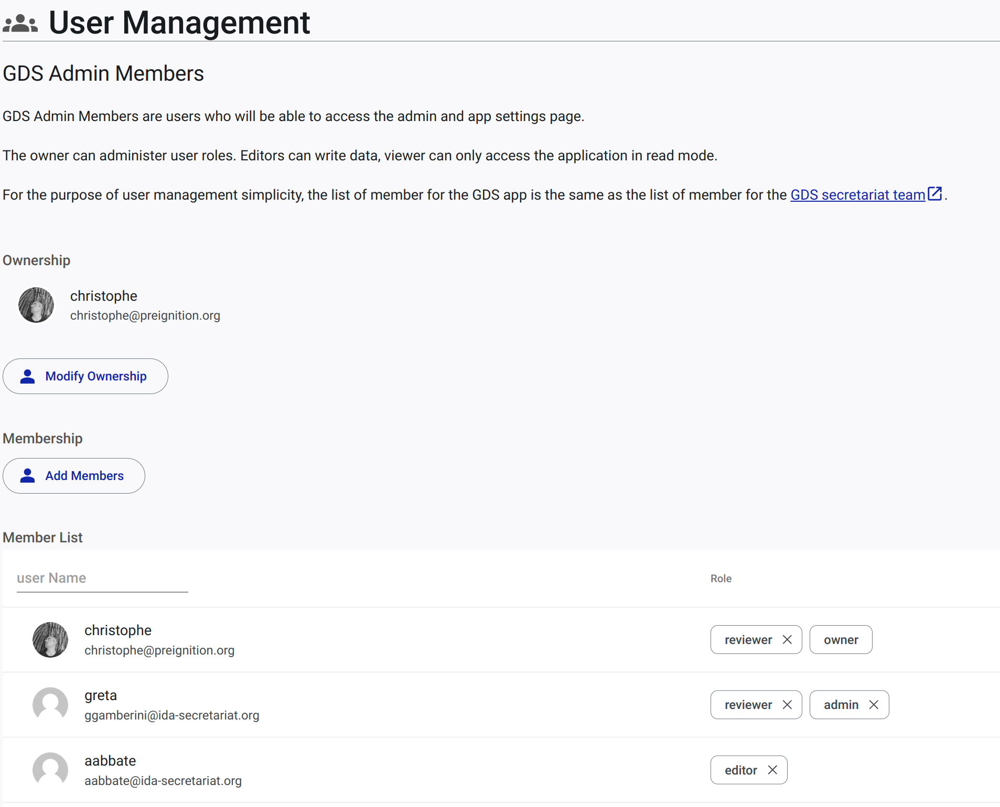
>
> Screenshot of the User Management page, with a list of users and actions to invite users, edit user roles and permissions, and delete users.

### Request Access

This page displays an overview of requests for access to the GDS Portal.

When a user requests access to an organization, the request is sent to the organization's admin, who can approve or reject the request. The user is added to the organization with the appropriate permissions when the request is approved.

Of an organization can also invite users. The invited user will receive an email with a link to create an account. The user is then added to the organization with the appropriate permissions when the invite is accepted.

This page also lists the open partnership requests.

> 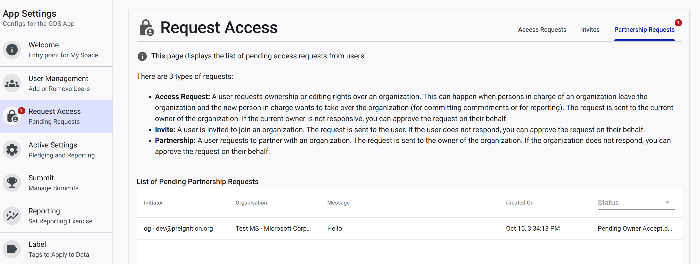
>
> Screenshot of the Request Access page, with a list of requests for access to the GDS Portal and actions to approve or reject requests. A badge indicates the number of pending requests.

Under the request access page, members of the GDS team Accept or decline requests on behalf of owner of organizations. This is useful when an owner of an organization is not available to accept or decline a request.

This page presents a list of pending requests. Clicking on a request opens a detailed view of the request, with the option to accept or decline the request.

### Active Settings

The Active Settings page is where the pledging and reporting periods can be opened or closed. When a pledging period is open, users can submit commitments. When a reporting period is open, users can submit reports.

> 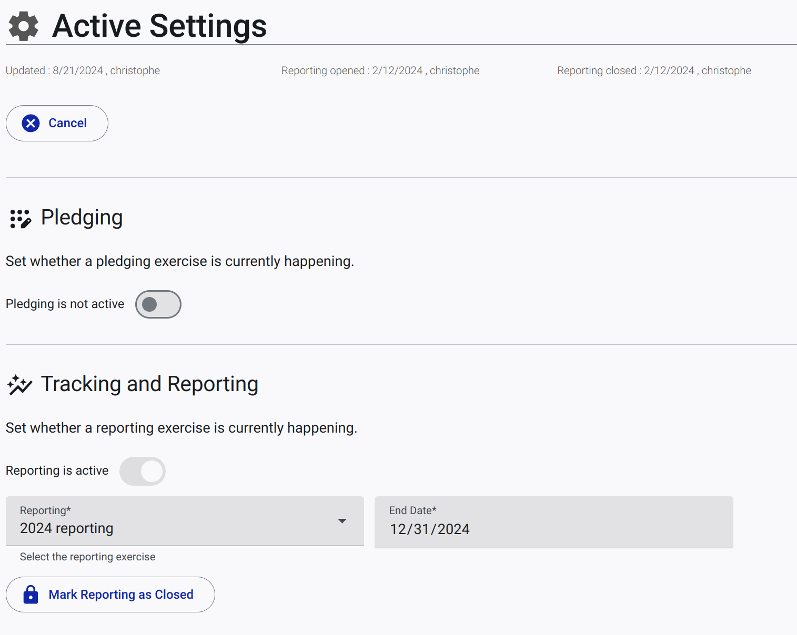
>
> Screenshot of the Active Settings page, with actions to open or close the pledging and reporting periods.

When pledging is active, it is possible to set a `summit` for the pledging period. New commitments will be linked to the summit. It is also possible to set and `end date` for the pledging period. This date is used to mark the end of the pledging period.

> 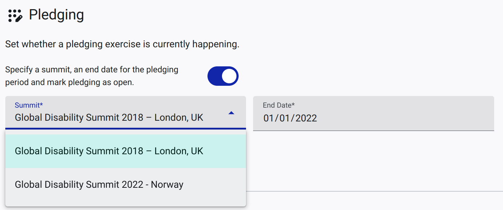
>
> Screenshot of the Pledging Settings, with actions to set the summit and end date of the pledging period.

A similar logic is applied to the reporting period.

### Summits

Summits are managed in the Summits page. The page includes a list of summits, with the date, location, and status of each summit.

Summit can be marked as the **active summit** (usually the last summit). The active summit is used to set which commitments are displayed in the admin `Commitments` page. Only commitments from the active summit are displayed in the admin `Commitments` page. This setting is applied to the individual user's view of the commitments.

By default commitments are private (only visible to the pledging body and the GDS co-hosts). Published joint Commitments are also visible to pledging bodies (users with an account on the GDS application). TO make approved commitments visible to the public, an `Mark Approved Commitments as Public` switch can be activated on the summit settings.

> 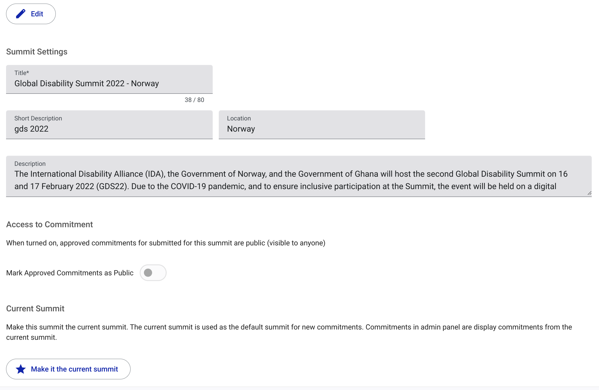
>
> Screenshot of the Summits page, with a list of summits and actions to mark the last summit as the active summit.

### Reporting period

The Reporting period page is where reporting periods can be managed. Users can add new reporting periods or mark the active reporting period.

Similarly to the summit, the active reporting period is used to display only reports from the active reporting period in the admin `Reports` page.

Similarly to the summit, reports are private by default. To make approved reports visible to the public, an `Mark Approved Reports as Public` switch can be activated on the reporting period settings.

> 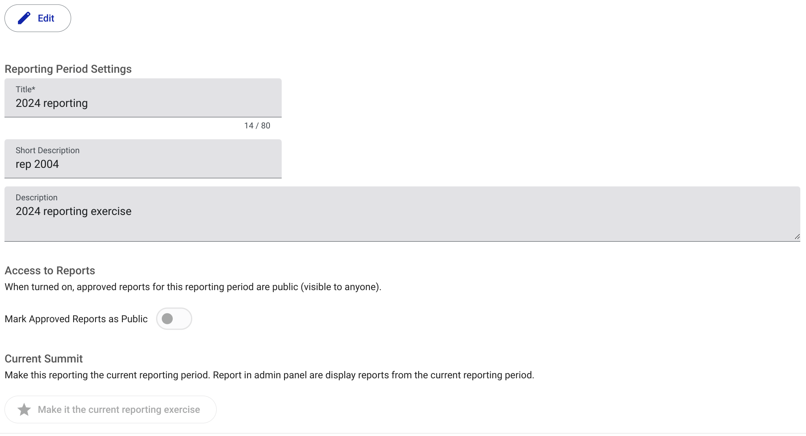
>
> Screenshot of the Reporting period page, with actions to add new reporting periods or mark the active reporting period.

### Labels

Labels are managed in the Labels page. The page includes a list of labels, with the name and color of each label. Users can add new labels or edit existing ones. Labels are used to categorize commitments or organisations reports.

> 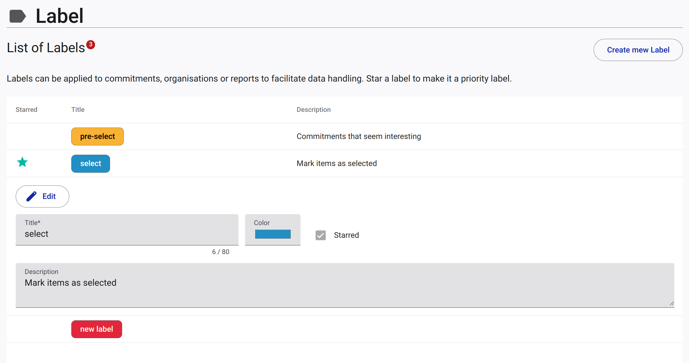
>
> Screenshot of the Labels page, with a list of labels and actions to add new labels or edit existing ones. A label has a color and a title.

### Mail Templates

Mail templates are managed in the Mail Templates page. The page includes a list of mail templates, with the subject and body of each template. Users can add new templates or edit existing ones. Mail templates are used to send emails to users, potentially with a call to action.

While editing a template, it is possible to test it. The test will send an email to the user who is currently signed in.

> 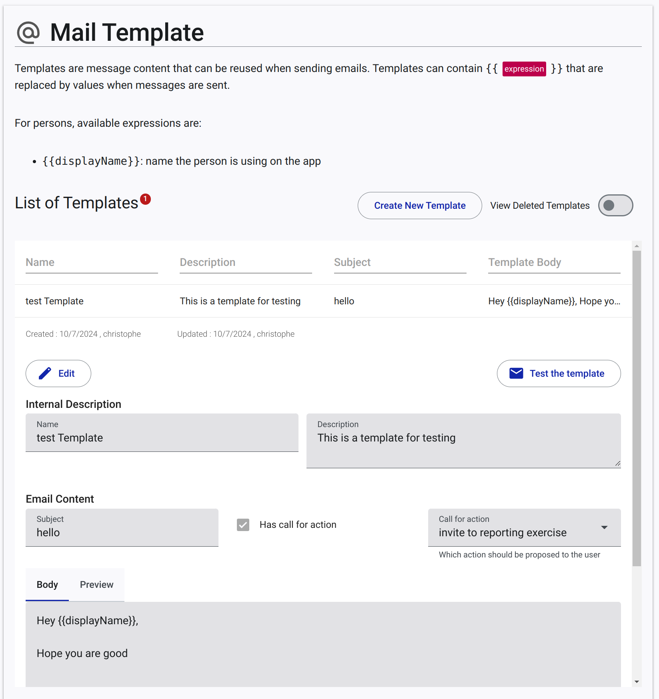
>
> Screenshot of the Mail Templates page, with a list of mail templates and actions to add new templates or edit existing ones. A template has a subject and a body.

### Reviewing

The Reviewing page is where users allowed to review commitments and reports can be managed. Users can be added or removed from the list of reviewers.

> 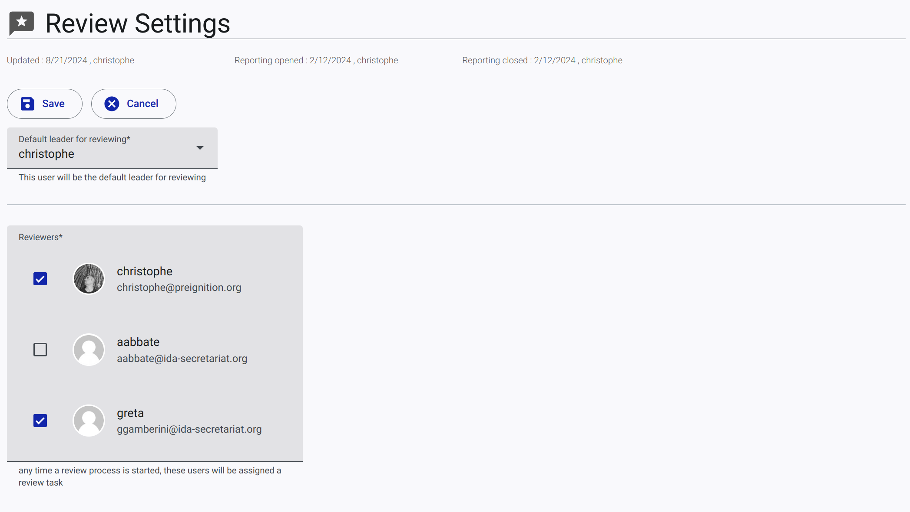
>
> Screenshot of the Reviewing page, with a list of users allowed to review GDS entities.

### Guidance

Link to guidance notes for the GDS Application.

### Release Notes

[Link to the release notes for the GDS Application](./RELEASENOTES.md).

### API Docs

[Link to the API documentation](/doc)

## Interactive Guide

The interactive guide is a tool to help users navigate through the app. The guide can be activated by hitting the `F1` key or clicking on the `help` icon top-right.

When the guide is available, a `help` icon appears on the top-right of the page. Clicking on the icon opens the guide, with a list of available actions and information.

> 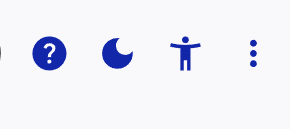
>
> Screenshot of the top-right menu with the help icon.

The first time the `My Space` page is opened, the guide is activated automatically. It displays an introduction page with a brief description of the guide itself.

> 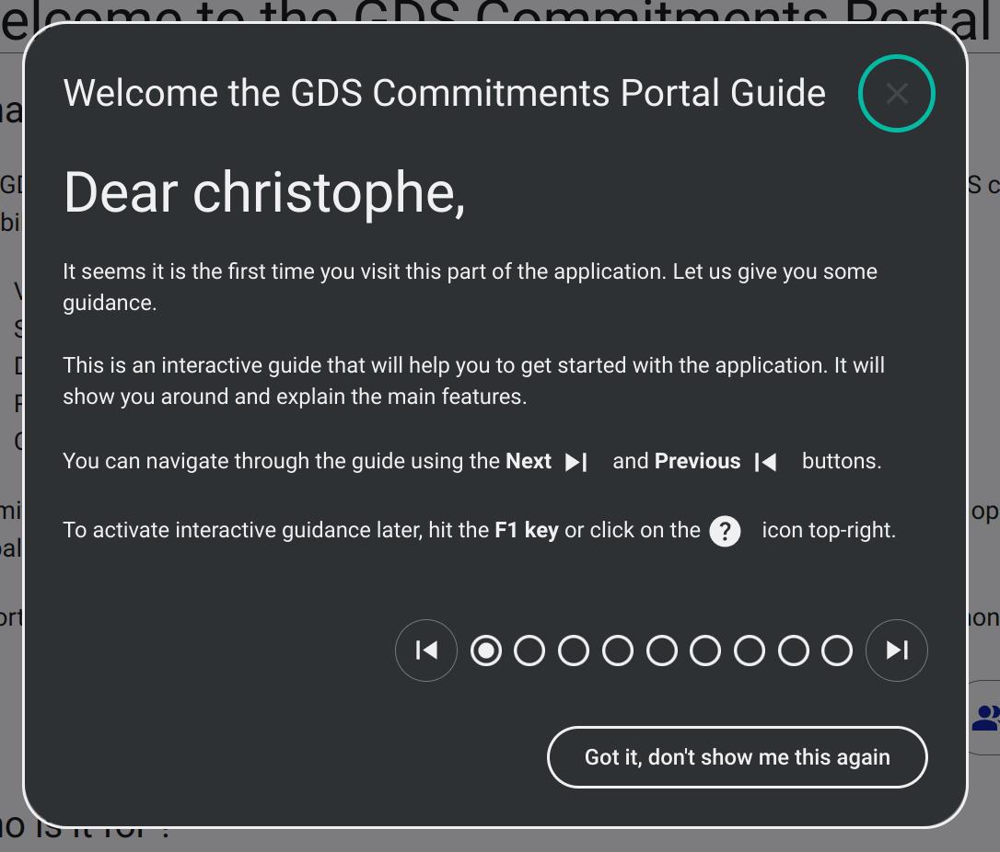
>
> Screenshot of the introduction page of the interactive guide.

The guide includes a series of steps to help users navigate through the app. Each step includes a description of the action or information.

> 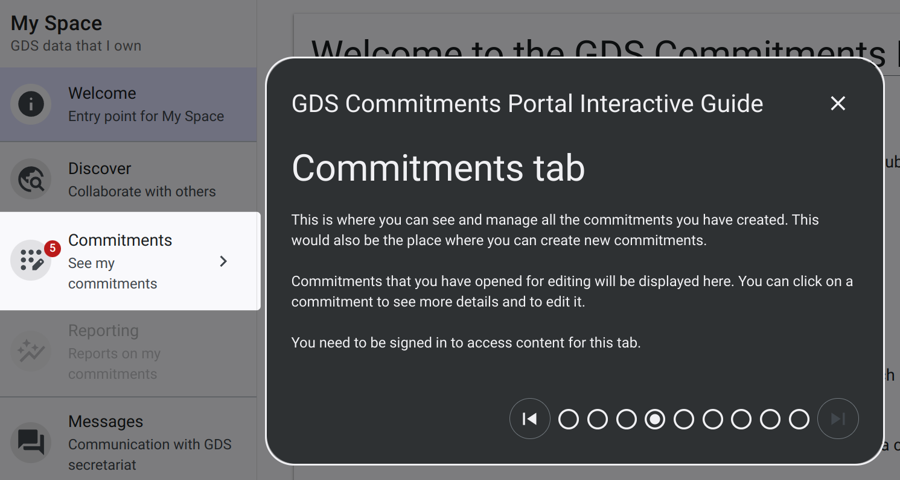
>
> Screenshot of a step in the interactive guide.
