# Release Notes

## 1.3.1 [2026-07-02]

### Feature

### All Reports View for Administrators

Admins and monitoring teams now have access to a comprehensive management grid that aggregates all progress reports across various organisations, reporting exercises, and summits. This makes tracking, validating, and searching reports extremely seamless.

The new view is accessible via a dedicated menu item in the navigation panel, which also features a notification badge indicating active reports in progress.

In contrast with the `Reporting` view, focusing on monitoring the reporting process for all organisation, this view focuses on the reports themselves, allowing to see all reports for all organisations, and to filter them by various criteria.

Key highlights of the new view include:

- **Comprehensive Filtering**: Real-time filters for Organisation, Acronym, Commitment title, Reported Progress, Summit, Status, and State.
- **Workflow State Tracking**: Instantly view whether a report is in `draft` or `submitted` state, and its progress status (e.g., `completed`, `Mostly completed`, `Significant progress`, `Early stages`, ...).
- **Inline Details & Direct Editing**: Expand any report row to view the full progress narrative on the spot. A quick-action button allows admins to open any specific report directly for editing or validation.
- **Deleted Reports Toggle**: Toggle the visibility of deleted reports via the `View Deleted Reports` switch to audit or clean up submissions.
- **Data Exporting**: Download the filtered dataset instantly in CSV format using the `Export` button.

> 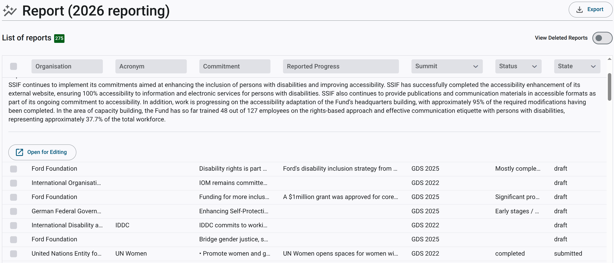
>
> Screenshot of the "All Reports" admin/monitoring grid, showing real-time filters, expanded progress details, and workflow status.
>
> 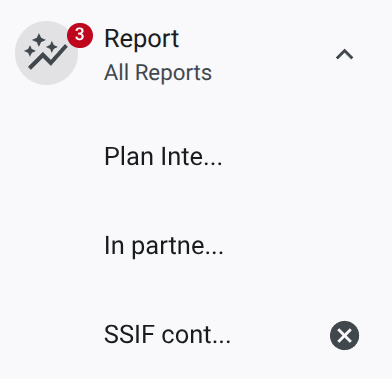
>
> Screenshot of the navigation panel showing the "Report" menu with a notification badge and active/pinned report tabs under the new "All Reports" submenu.

Clicking on a grid row will expand the row to show the progress report narrative, and a button to open the report in a new page for detailed viewing.

### Schema-First Effect API and Scalar Documentation

The GDS backend API has undergone a major modernization, migrating from TSOA to a highly robust, schema-first **Effect API**. This alignment with the rest of the monorepo architecture enhances type-safety, improves validation error handling, and significantly boosts response performance.

Additionally, we have upgraded our API documentation suite:

- **Interactive API Documentation**: Replaced RapiDoc with **Scalar** to deliver a more modern, responsive, and developer-friendly documentation interface.
- **Automated OpenAPI Specifications**: The deploy process now automatically compiles and hosts separate unified (`openapi.json`) and GDS-specific (`openapi-gds.json`) OpenAPI specifications, enabling external partners and internal developers to integrate easily.
- **Enhanced Endpoint Filters**: Core endpoints like `getReports` now fully support rich filtering parameters, including status and deletion state, powering the new frontend administrative features.

New documentation is available at [https://gds-docs.idata.tools/api.html](https://gds-docs.idata.tools/api.html).

### Fixes

### Accessible Progress Report Attachment Handling

We have improved the visibility and handling of files uploaded with progress reports. Admins and users can now easily verify and access supporting documents associated with any commitment report.

- **Bullet List Format**: Attachments are formatted as a clear, structured list displaying the exact filename.
- **Non-Latin Character Support**: Fully supports files with non-Latin filenames (e.g., Arabic, Cyrillic, etc.) without corruption.
- **Instant Previews**: Each file includes an external link icon to download or preview the file directly from the report summary.
- **Empty State Indicator**: Displays a clean `"No attachment"` message (spelled as `"No attachement"` in the UI) when no files are uploaded, avoiding layout empty spaces.

> 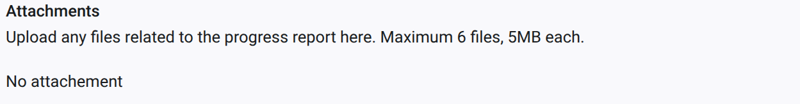
>
> Screenshot displaying the clean empty state message when a progress report has no uploaded attachments.
>
> 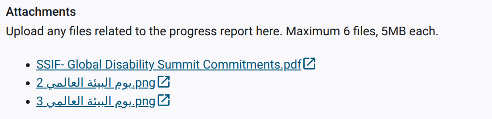
>
> Screenshot showing the list of uploaded attachments with support for multi-language filenames and external link icons for quick access.

## 1.3.0 [2026-06-10]

### Feature

### New Documentation for the GDS Portal Application

A new web-site has been created to host documentation for the GDS Portal application. This documentation includes user guides, technical documentation, and release notes. The documentation is accessible at [https://gds-docs.idata.tools/](https://gds-docs.idata.tools/).

> 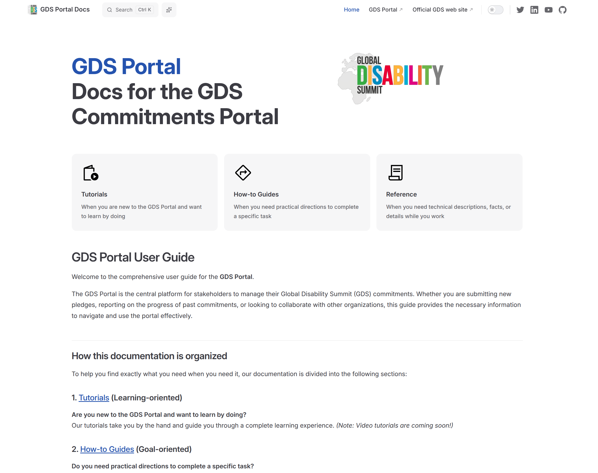
>
> Screenshot of the GDS Portal documentation homepage, showing the different sections of the documentation.

A new help link has been added to the main navigation menu of the GDS Portal application, linking to the documentation website.

> 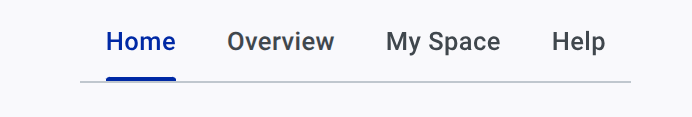
>
> Screenshot of the navigation menu with the new help link visible.

#### View Joint Commitment Partner Users

Users can now see a detailed list of individuals associated with partner organizations for a joint commitment. A "See Partners Users" button has been added to the commitment summary section of the report, opening a dialog that lists all members from the collaborating organizations.

Joint commitments are also now also more clearly marked with a dedicated indicator

This implementation path  was chosen for performance reasons, as it allows to load the list of users for partner organizations on demand, only when the user click on the button.

> 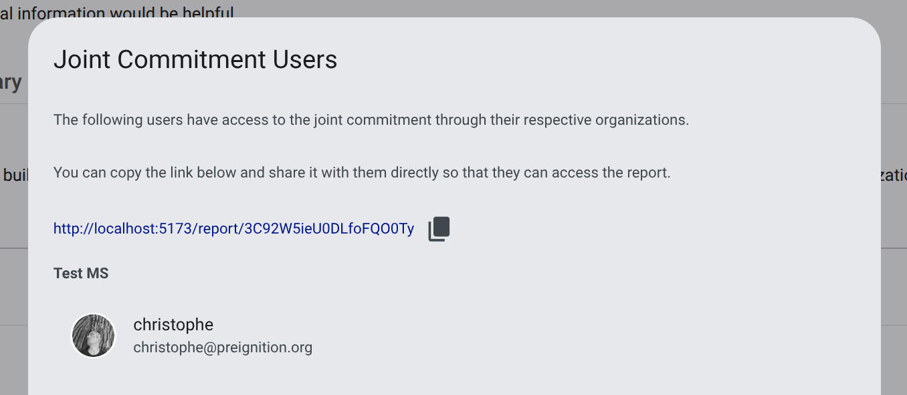
>
> Screenshot of the dialog displaying users from partner organizations for a joint commitment. The dialog includes a list of user cards with their names and roles, and a copyable link to share access to the report with these users.

### New GDS 2025 Reporting Template

The reporting form has been updated with new fields including reporting year, partnership context, implementation factors, targeted population groups, GDS influence, and OPD engagement.

> 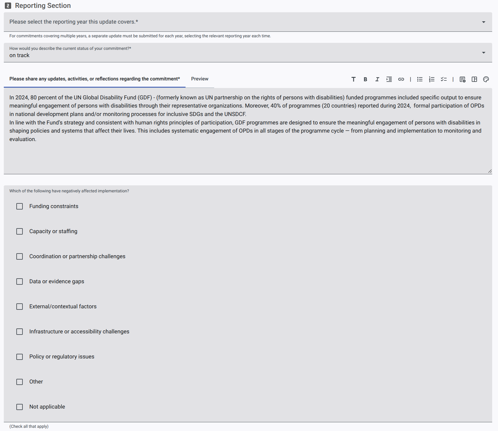
> 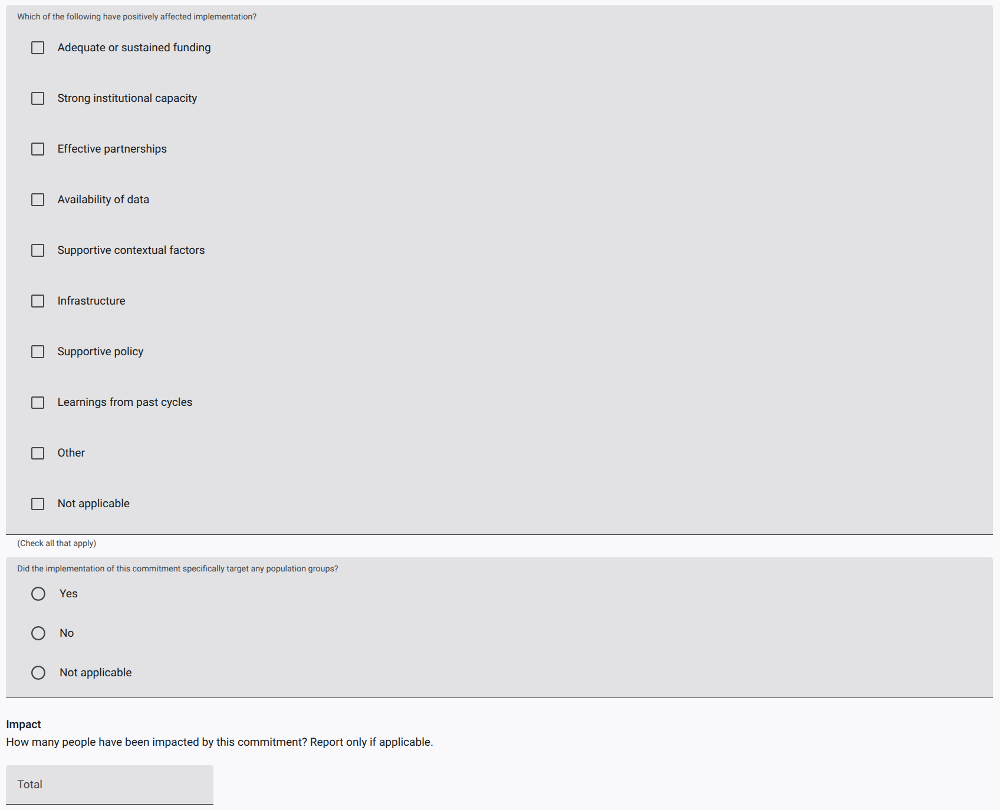
> 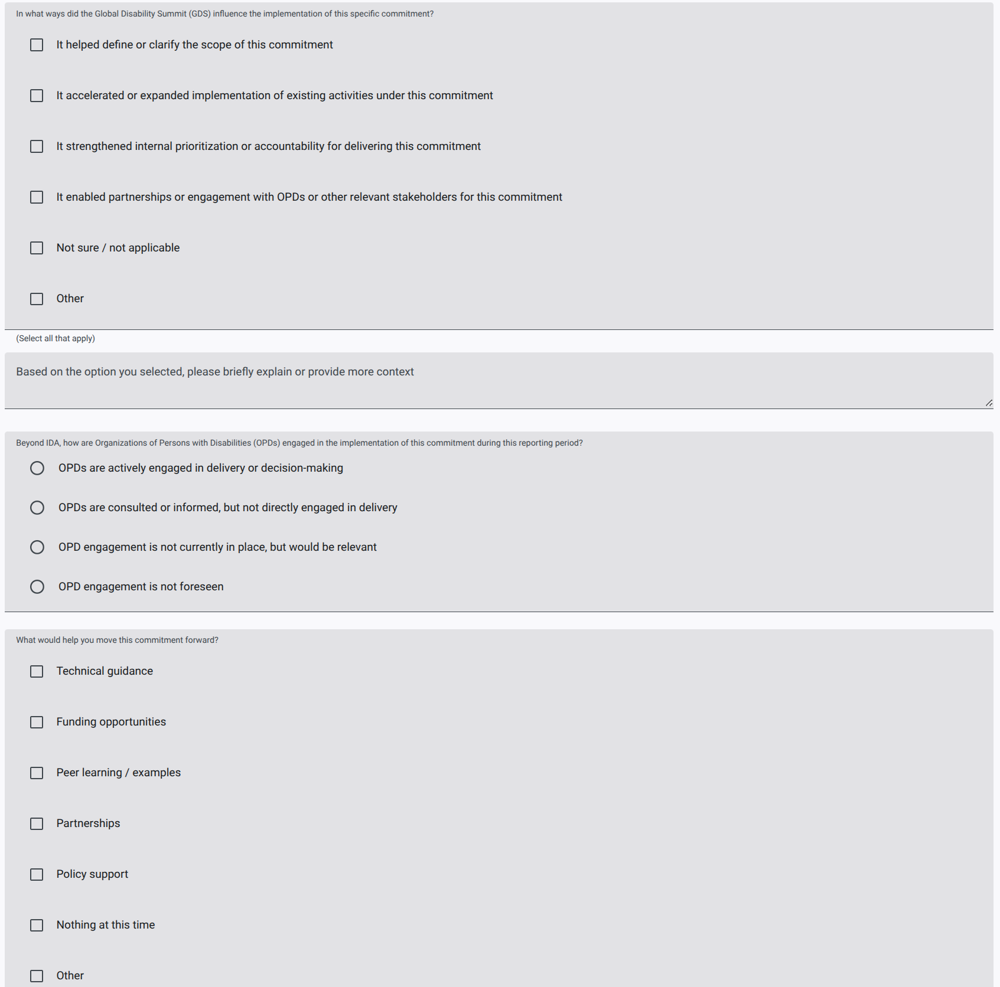
> 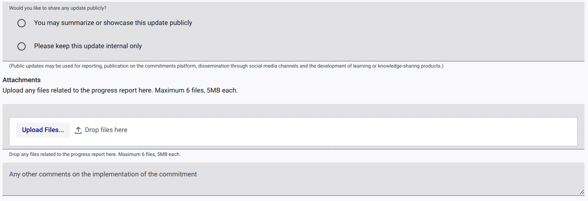
>
> New reporting template with additional fields for GDS 2025 reporting exercise. The form includes sections for commitment details and progress report, with new fields to capture more comprehensive information about the implementation of commitments.

### Updated Messaging

Welcome messages and submission success notifications have been updated to reflect the GDS 2025 reporting exercise.

> 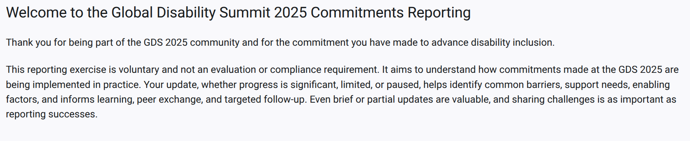
>
> Screenshot of the updated messaging for the draft state of a report

### Draft-state Logout Notification

Users are now prompted with a warning if they attempt to log out while having reports in a draft state, ensuring no progress is accidentally lost.

> 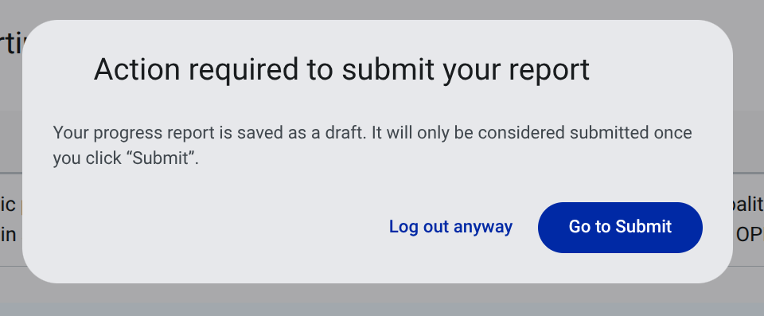
>
> Screenshot of the logout confirmation dialog when the user has reports in draft state. The dialog warns the user that they have unsaved progress and gives them the option to cancel the logout or proceed.

### Accessible Table View for Reporting

Screen reader users can now switch to an alternative table view for initiating commitment reports. This semantic HTML table provides a clear, linear way to browse and select commitments for reporting, bypassing the complexities of the interactive grid.

> 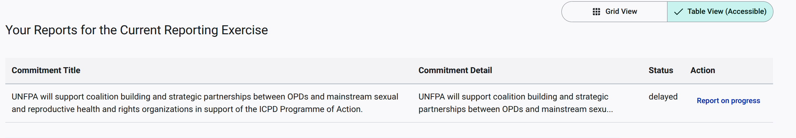
>
> Screenshot of the accessible table view for the reporting feature, providing a clear, linear way to browse and select commitments for reporting.

### Pledger Ownership Management

GDS secretariat members can now manually transfer the primary ownership of an organization to a new user. This administrative tool allows for seamless account handovers when stakeholder personnel change, ensuring uninterrupted access to commitments and reports.

> 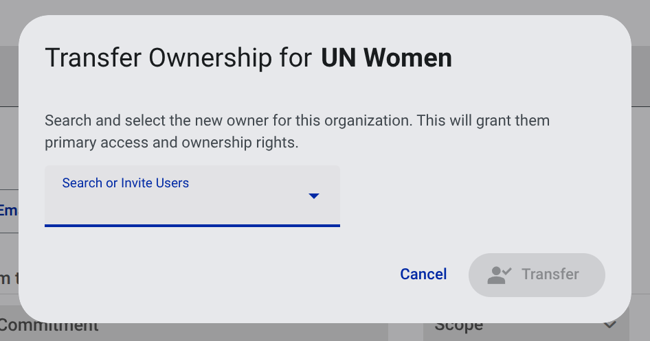
> 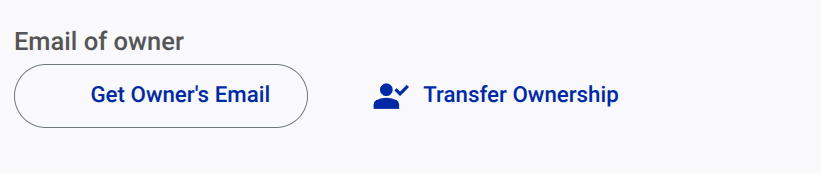
>
> Screenshots of the transfer ownership feature, showing the button to open the transfer ownership dialog and the dialog

### Enhanced Admin Reporting Status Tracking

The admin reporting monitoring panel now includes a real-time summary dashboard. Admins can instantly see the total counts of organizations in various reporting stages: Not Started, Pending, Validating, and Completed. This provides a high-level overview of the progress of any selected reporting exercise (including GDS 2025/2026).

> 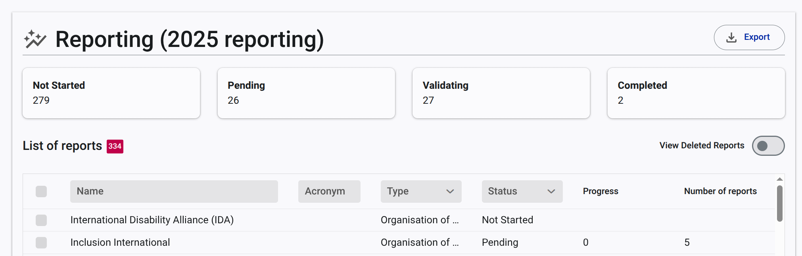
>
> Screenshot of the admin reporting summary dashboard, showing the total counts of organizations in different reporting stages for a selected reporting exercise.

### Improved password recovery flow

The `I forgot my password` link is now always visible on the login page, allowing users to easily access the password recovery process without needing to first encounter a failed login attempt.

### Reporting Cycle Settings

In the `App Settings` > `Active Settings` section, the GDS Secretariat team can now specify which summits are associated with a reporting cycle. This allows for more granular control over the reporting process, enabling the GDS Secretariat team to open reporting cycles for specific summits rather than all summits at once.

> 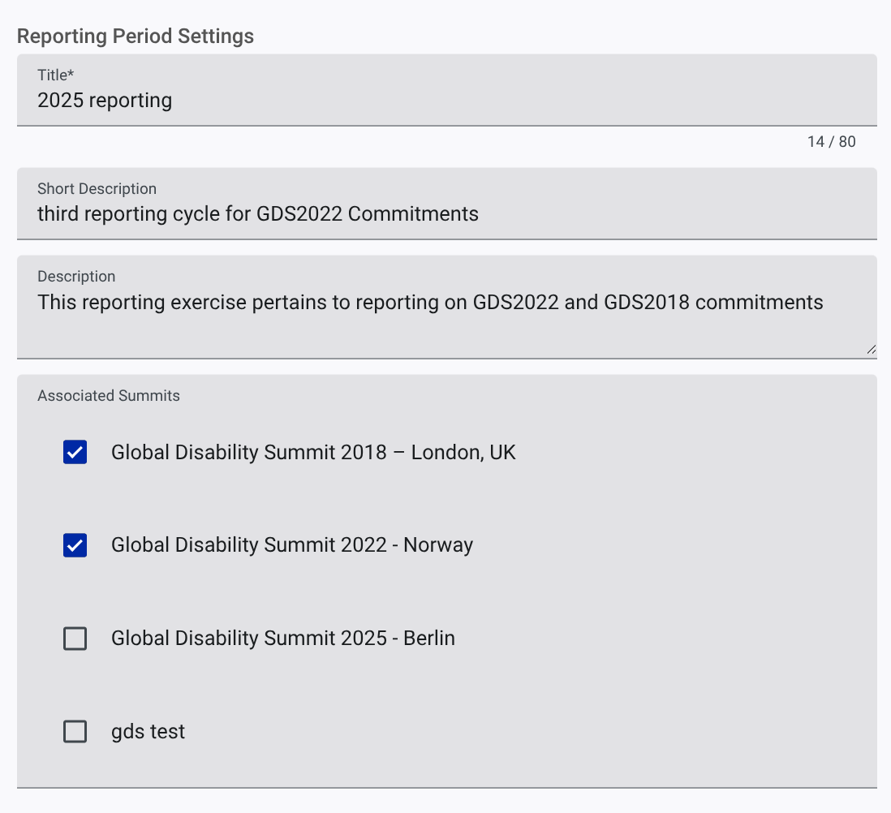
>
> Screenshot of the reporting settings in the admin panel, showing the option to select which summits are associated with the reporting cycle.

## Modification

- The discussion app is removed as not really used.

### Updated Messaging for Account Creation

Signed-off users are invited to create an account with a new messaging on the welcome page (instead of the `Start submitting commitments` call to action). This new messaging is more informative and inviting, encouraging users to create an account to access the full features of the GDS Portal.

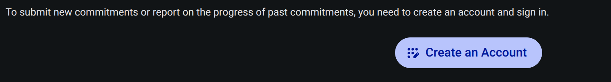

## FIX

### Improved message on Incomplete Account Setup

User now receive a more informative message when their account setup is incomplete, including potential reasons for the issue and clear instructions on how to resolve it. CLicking on the contact email opens a pre-filled email template to streamline support requests (with organisation details included).

> 
>
> Screenshot of the improved messaging for incomplete account setup, including reasons why this is still displayed.

### Navigation loop while accessing `My Space`

Clicking twice on the `My Space` was causing a loop in the URL replacement logic, preventing users from accessing the `My Space` page. This has been fixed by adding a one-time event listener to cancel the next navigation event after the first URL replacement, allowing users to access the `My Space` page without being redirected back to the login page.

### Actions helper

Buttons top of the form now have a helper text to clarify their function. For example, the `Take Over` button now includes a helper text "Take over the report as" to indicate that it allows users to take over the report on behalf of another user.

<!-- 
Planned:

- [ ] add ways to specify which commitments are to be reported on for a specific reporting cycle
- [ ] mark commitments as completed when a report so and the report is approved. Completed commitments will not have to be reported again in future reporting cycles.
- [ ] make sure admin have access to uploaded files -->

### Fix

- pressing `enter` on login page should activate the login
- fix link to GDS team to add members to an organization

## 1.2.0 [2026-01-20]

### Feature - make reports publicly available

The `overview` page now display reports that have been made publicly available by the GDS Secretariat team. This is done by clicking on the `View Reports` button in the `Overview` page.

> 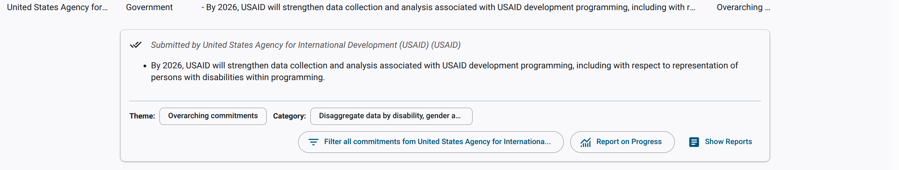
>
> Screenshot of the overview page with the `View Reports` button visible.

The `View Reports` button is only visible when reporting have been marked as `make approved reports public` in the `App Settings` > `Reporting` section.

> 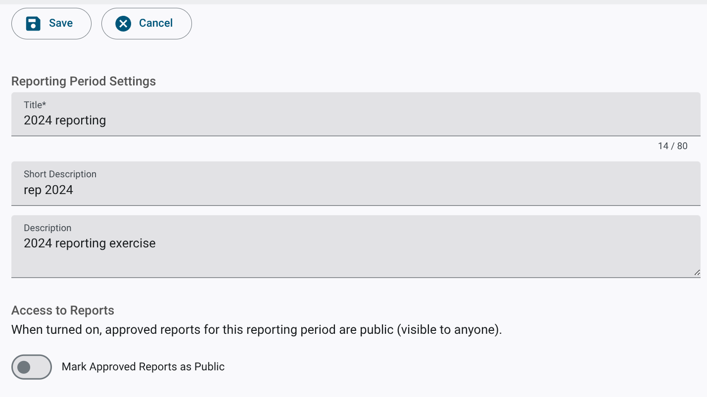
>
> Screenshot of the admin panel to mark approved reports as public.

Reports approved are displayed in a tabular format, with the following columns: reporting exercise, report body, status.

> 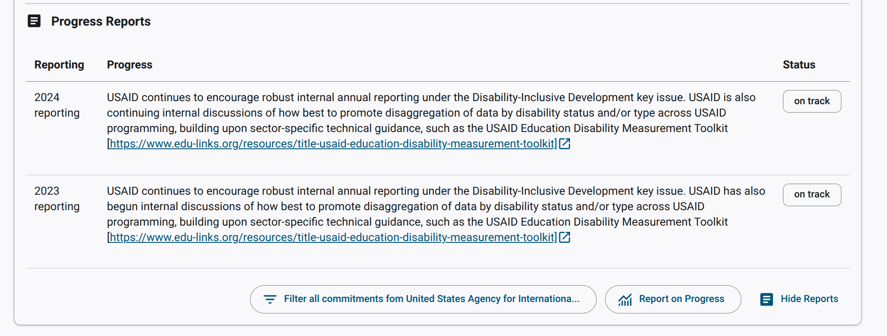
>
> Screenshot of the public display of reports.

## 1.1.1 [2025-12-27]

### Architecture

All actions handling are now using `Effect`. This improve the maintainability of the code and make it easier to add new features in the future. It also aligns the gds-app with the rest of the codebase.

## 1.1.0 [2025-10-01]

This release brings several improvements to the reporting feature, including:

### Feature - Reporting

Admin user can now see the list of reports for a given organisation from the admin panel. Expanding the list displays a detailed view of the report, including the ability to open it on a new page for even more details.

> 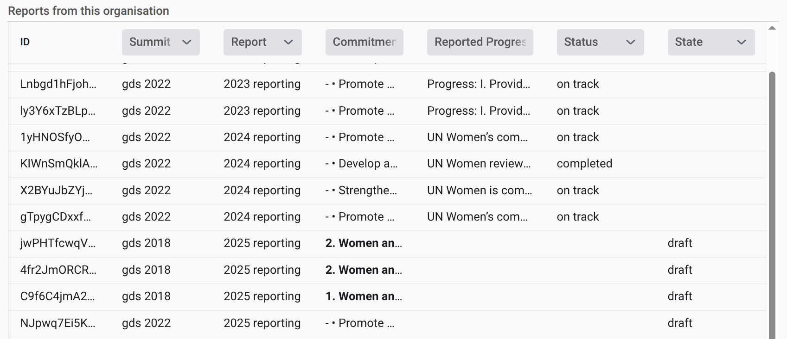
>
> Screenshot of the admin report list, showing the list of reports for a given organisation. The list displays the status of each report (pending, submitted, approved), the summit, the reporting exercise, the commitment title and a link to open the report in a new page.

Admin can also see the detailed list of reports from the reporting (monitoring progress) page. Expanding the list of reports for a given organisation displays the same detailed view of the report as in the admin panel, with the ability to open each report on a new page.

> 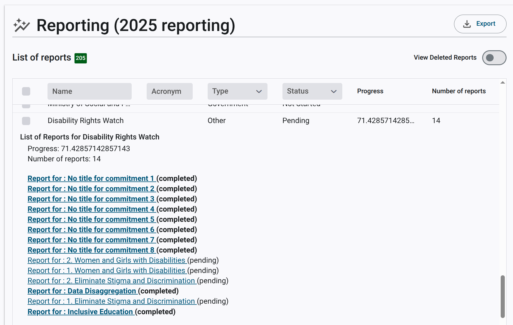
>
> Screenshot of the admin report list expanded,

### Fixes

Various small fixes that sometimes led to failing the rendering of detailed views

## 1.0.0 [2025-05-01]

### Feature - Reporting

This release introduces the reporting feature, which allows users to report on their progress against their commitments. The reporting feature is accessible from the `Reporting` tab in the `My Space` tab.

#### Opening a Reporting Cycle

Prior to reporting, the GDS Secretariat team must open a reporting cycle. This is done from the `App Settings` > `Active Settings` section. The reporting cycle can be opened for a specific summit or for all summits.

> 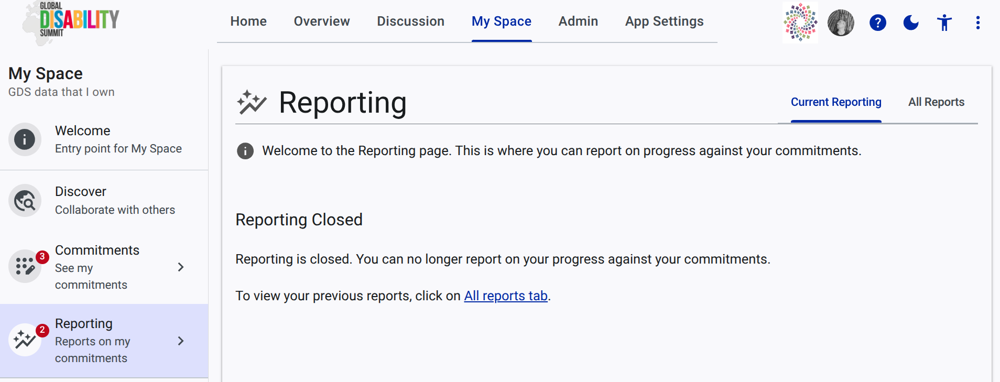
>
> Screenshot of the active settings when reporting is closed.

To open a reporting cycle, the GDS Secretariat team must edit the `Active Settings` section and set the `Reporting is open` toggle to `on`. This will open the reporting cycle for all users.

> 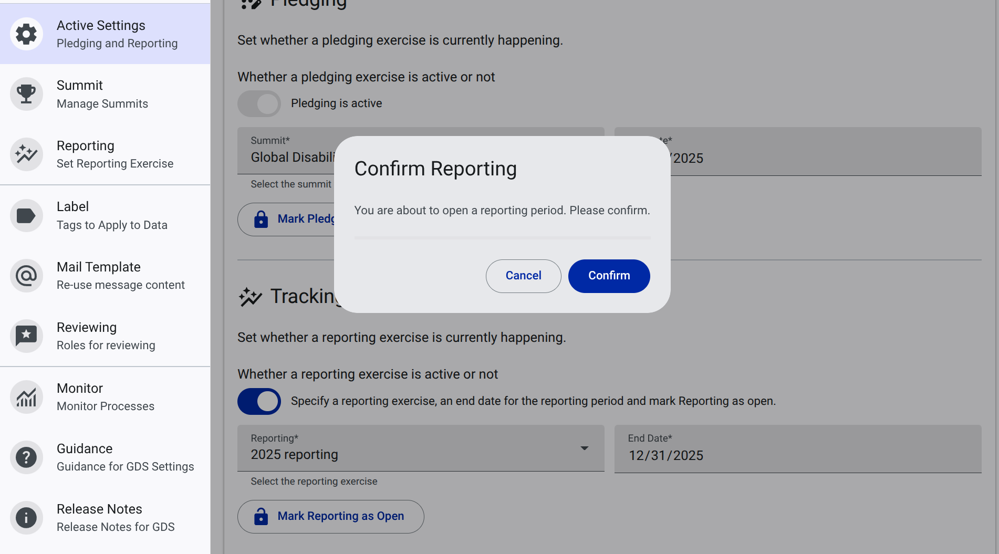
>
> Screenshot of the active settings when reporting is being opened.

#### Reporting Process (User)

Users can only start reporting when the reporting cycle is open.

When it is closed, user see the following screen when they click on the `Reporting` tab:

> 
>
> User page screenshot when the reporting cycle is closed. A user cannot report on their commitments, but can see all previous reports.

When the reporting cycle is open, users can start reporting by clicking on the `Start Reporting` button. This will open the reporting process for him:

> 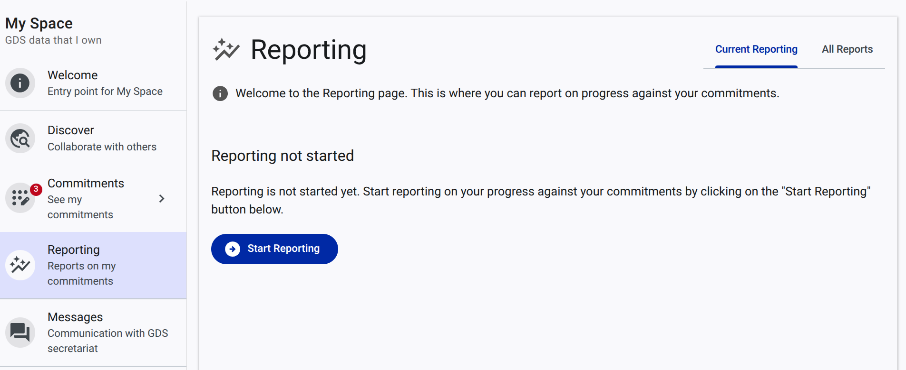
>
> User page screenshot when the reporting cycle is open, but not yet started.

Clicking on the `Start Reporting` button will create all report entries (one for each commitment to be reported). Each report is set to a `draft` state, meaning that the user can edit it. The user can then fill in the report for each commitment by clicking on the `Edit` button next to each report entry:

> 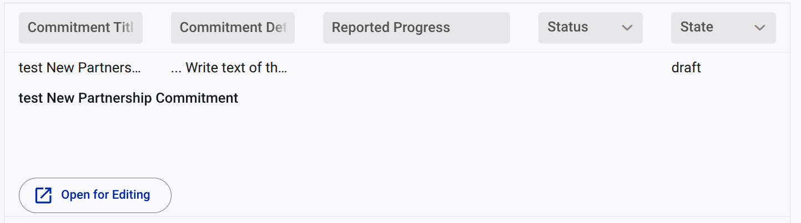
>
> Screenshot of the reporting grid detail, allowing to edit reports.

A new entry is added to the report menu whenever a report is edited. This simplify navigation for users:

> 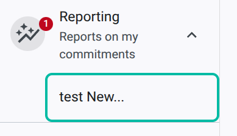
>
> Screenshot of the report menu, showing the list of open reports.

The reporting form is rather simple, with the following sections:

1. **Commitment Details**: This section displays the commitment details, including the title, description, and categorization fields.

2. **Progress Report**: This section allows the user to report on the progress against the commitment. The user can specify the following:
   - Generic progress narrative (markdown)
   - Progress Status (e.g. `On Track`, `Delayed`, etc.)
   - Upload relevant files (e.g. reports, documents, etc.) related to the progress of the commitment (max 6 files, max 5 Mb).
   - When relevant, reason for not completing the commitment.
   - Other implementation comments

> 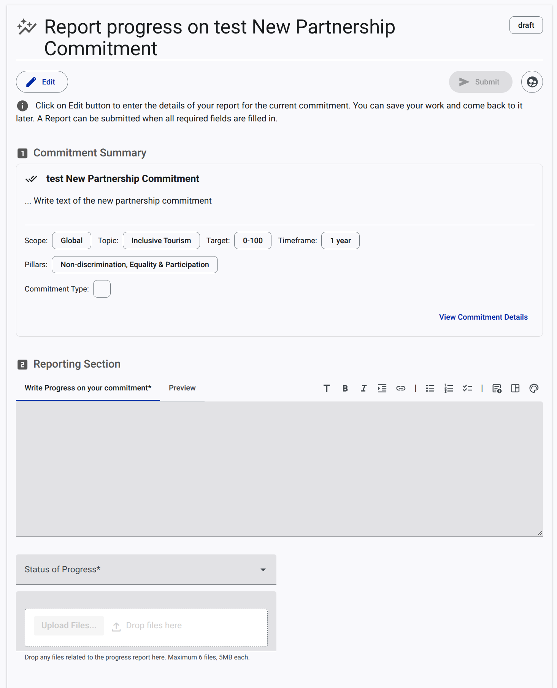
>
> Screenshot of the report form, showing the commitment details and the progress report section.

When the form is completed, the user can `submit` it. This updates the progress information on the `Report` page, which shows the total number of commitments reported on, and the number of submitted reports:

> 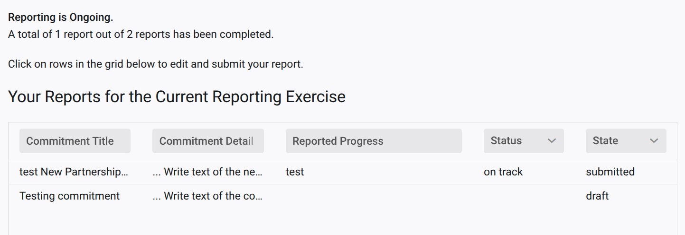
>
> Screenshot of the report progress page, showing the total number of commitments reported on, and the number of submitted reports.

#### Reporting Process (GDS Secretariat)

When a user starts its reporting process (by clicking on the `Start Reporting` button), another `reporting` entry is created on the database, which is used to track the reporting process.

This reportings entry has the following states:

- **`provisionReport`**: reports are being created for each commitment to be reported.
- **`pending`**: the user is reporting on its commitments.
- **`validating`**: the user has submitted all its reports and the GDS Secretariat team can now validate them.
- **`done`**: the GDS Secretariat team has validated all reports and the reporting process is completed.

Validating a report is done by clicking on the `Approve` button at the top of the report form. This button is only visible to the GDS Secretariat team and when the report is submitted.

> 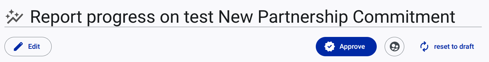
>
> Screenshot of the report form with the `Approve` button visible to the GDS Secretariat team.

#### Analytics

When a reporting cycle is open, the `report on progress` in the overview page is active. User clicking on it will be redirected to their own reporting page, where they can report on their commitments.

When the reporting cycle is closed, the `report on progress` in the overview page is inactive.

> 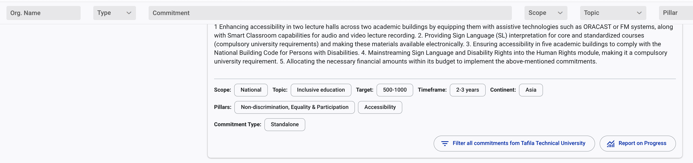
>
> Screenshot of the overview page with the `report on progress` button active.

### Fixes

- menu items for small screens not reacting to click events

## 0.9.0 [2025-03-19]

### Fixes

Various fixes have been made to improve the user experience and fix bugs:

- [x] Review list not displaying details
- [x] Requests change window not editable
- [x] Requests for reject not editable
- [x] missing filters for state

## 0.8.0 [2025-03-19]

### Feature - Analytics

The analytics consist of 3 linked parts:

- the Header with a way to Select the Active GDS Summit. The active summit is the one that is currently displayed in the analytics view.
- The chart section which displays a summary of statistics about GDS data.
- The table section which displays a detailed view of the data.

The entire data set is loaded on the client making it very fast you play with the data. Data is cached so that it is faster to load on the client.

As the data collected during the different summits differs from one summit to another, the content of the analytics page depends on the active summit. For instance, `pillars` and `scope` will only be presented in the GDS 225 summit.

> 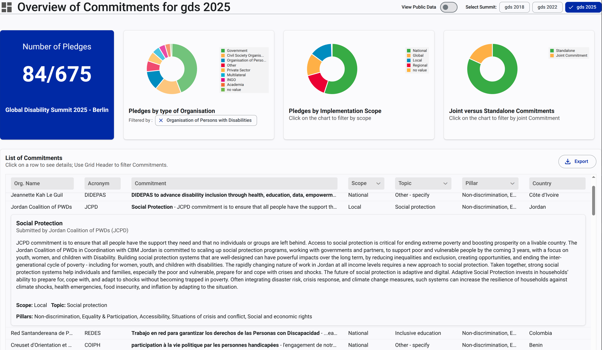
>
> screenshot of the analytics view.

Analytics only display public pledges. Pledges are made public by the GDS Secretariat team from the app setting panner > summits. An information panel will display a message indicating that the data for the specific summit has not been made public when it is the case and analytics are not displayed.

> 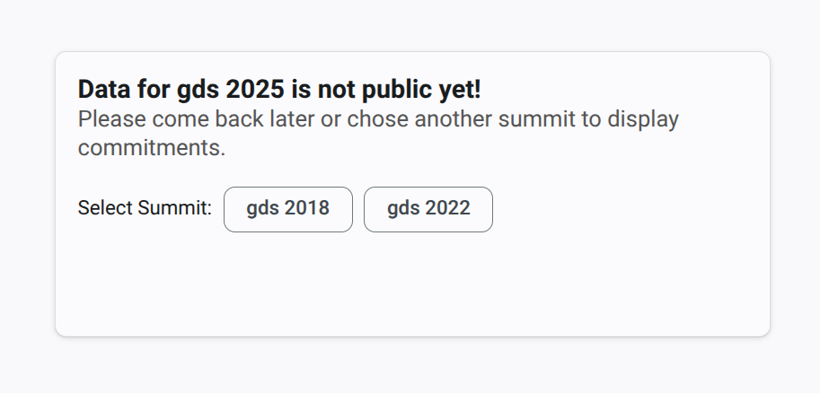
>
> information panel when the data for a specific summit has not been made public.

The chart section consists of one `counter` widget summarizing the number of commitments,  and a set of widgets presenting a summary of the data for the active summit against one dimension (e.g. type of organisation, scope, etc.).

Charts are interactive. Clicking on a chart will filter the data in the table section and the other charts. The active filter is displayed below the charts. Clicking on this filter will remove it.

The counter widget is animated. When the page is loaded, the counter will start from 0 and increase to the actual value.

The table section displays the data in a tabular format. The data can be filtered by entering value in the column header. The table is not paginated; it Displays all data at once. Clicking on a row will expand it and Show commitment details with the organization submitting it and other metadata. Clicking on the row again will collapse it.

The table section has a `download` button that will download the data in a CSV format.

For the GDS 2025 summit, the table section displays the following columns:

- organisation name
- organisation acronym
- commitment title and content (resizable column)
- Scope (e.g. `National`, `Regional`, etc.)
- Pillar (e.g. `Accessibility`, `Non-discrimination, Equality and Participation`, etc.)
- Topic (e.g. `Health Equality`, `Inclusive Education`, etc.)
- Country

For the same summit the charts displayed are:

- distribution of commitments by type of organisation (donut chart)
- distribution of commitments by scope (donut chart)
- distribution of commitments for standalone vs joint commitments (donut chart)

### Feature - Display Commitments in Organisation

The detailed view of an organisation now displays the commitments submitted by the organisation. The commitments are displayed in a table.

### Feature - Take over pledger rights

In some situations, the GDS Secretariat team members may need to take over the rights of a user to submit a commitment. But because this entails some responsibilities and risks, the user must turn the `Take over` icon button on.

This can be done from the detailed view of the commitment by clicking on the `Take over rights` button. Once the button is clicked, the user can take any action the pledger would have the right to.

> 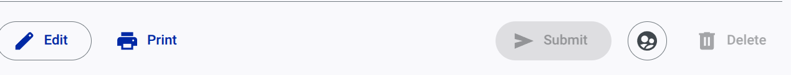
>
> A screenshot of the take over rights button. The icon is an icon button with a `Take over` label for screen readers.

### Feature - export list of commitments and organisations

Exporting list of organisations and commitments now takes into account the selected items. If no item is selected, all items of the grids are exported.

## 0.7.0 [2025-03-09]

### Feature - Organisation User Rights

GDS admin members can now set user rights for an organisation. This feature is accessible from the detailed view for an organisation, by clicking on the `Edit` button. In `edit` mode, the admin can set the user rights for the organisation:

> 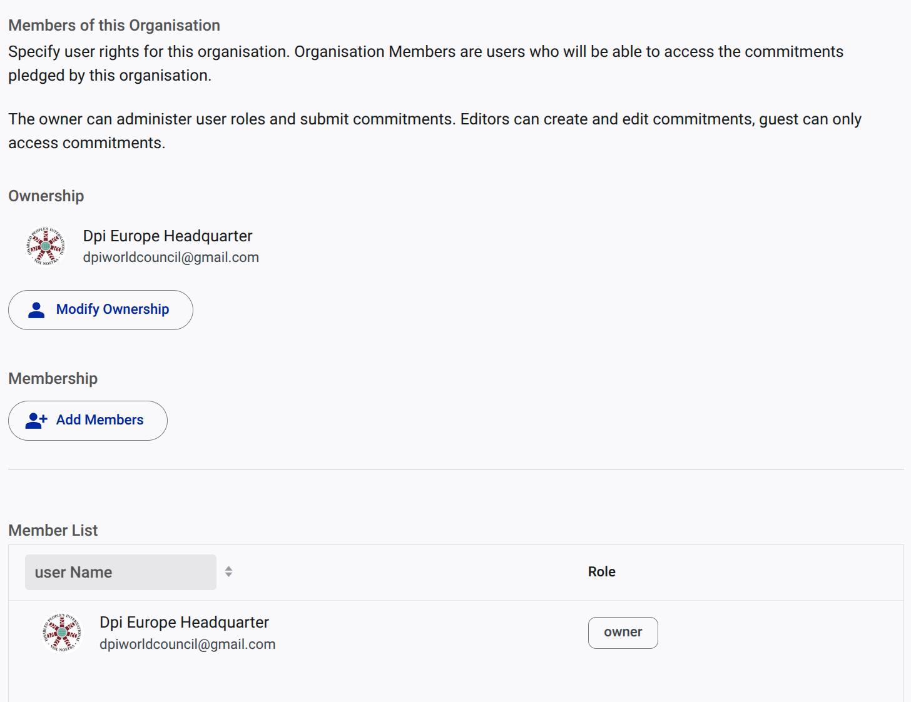
>
> screenshot of the edit organisation view.

### Fixes - Organisation title

The organisation title was not displayed correctly in the organisation detailed view (it was displaying `Missing title`). This has been fixed.

## 0.6.0 [2025-03-02]

It is now possible to add new reviewers even when the review process is completed (e.g. all current reviewers have finalized their review). The process is similar to adding reviewers when the review process has started, by clicking on the `Add reviewer` button. This will revert the commitment to `submitted` state where it is possible to add new reviewers.

The current state of the commitment is displayed next to the title of the commitment. It is visible to the process owner and reviewers only.

> 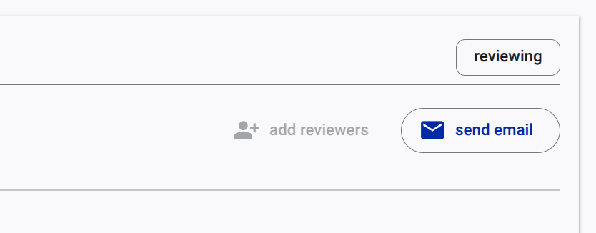
>
> screenshot of the lifecycle status of a commitment.

## 0.5.0 [2025-02-23]

Improved a11y experience for writing review for commitments. Prior to this release, the review had to be written in the grid displaying reviews for all reviewers. Now, the review can be written in a dedicated view placed on top of the grid. This improves the accessibility of the review process, esp. as the grid is difficult to operate with a screen reader.

> 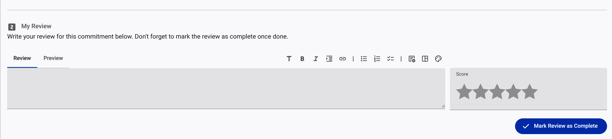
>
> screenshot of the individual review view.

## 0.4.0 [2025-02-21]

### Feature - Additional Reviewers

Improve commitment lifecycle by adding a way to include additional reviewers even when the review process has started.

When commitment is in a `review` state, the owner of the review process can add additional reviewers:

> 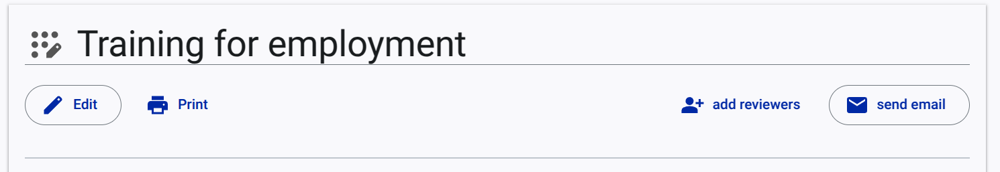
>
> screenshot of the review process with the `Add reviewer` button.

Clicking on the `Add reviewer` button will open a confirmation modal window:  

> 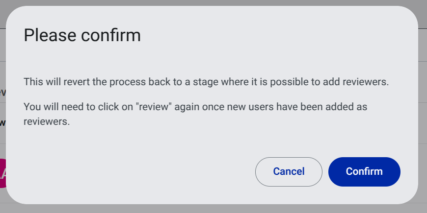
>
> screenshot of the confirmation modal window to add a reviewer.

Confirming this action will revert the commitment to `submitted` where it is possible to add additional reviewers. The list of users that can be added as reviewers is stripped from the already selected reviewers (it is possible to add users, not remove them).

Once new reviewers are added, the owner of the review process **MUST** the review process again by clicking on the `Start review` button. Otherwise the added reviewers will not be effective (no review task created for them).

### a11y Enhancements

The task grid now focuses on the open button when the detailed view is opened.

Screen reader announce when the detailed view is opened or closed.

### Other changes

A `not applicable` option is added to the field `Number of people with disabilities targeted` in the commitment form.

## 0.3.1 [2025-02-17]

### Fixes

- Fix user not able to edit commitment once saved.

## 0.3.0 [2025-02-16]

The owner of the review process can now select reviewers for each commitments before starting the review process. Potential reviewers are set in `App Settings` > `reviewers`.

> 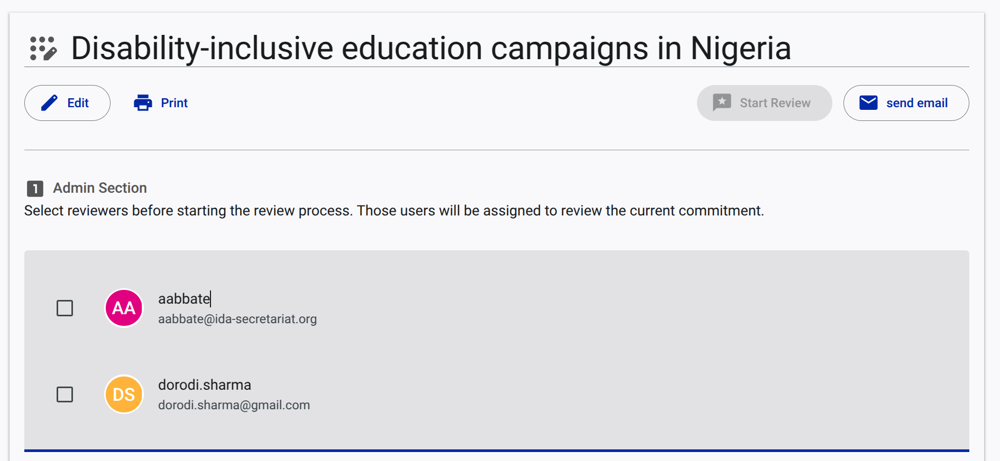
>
> screenshot of the review process without reviewer selected. `Start review` button is disabled.
>
> 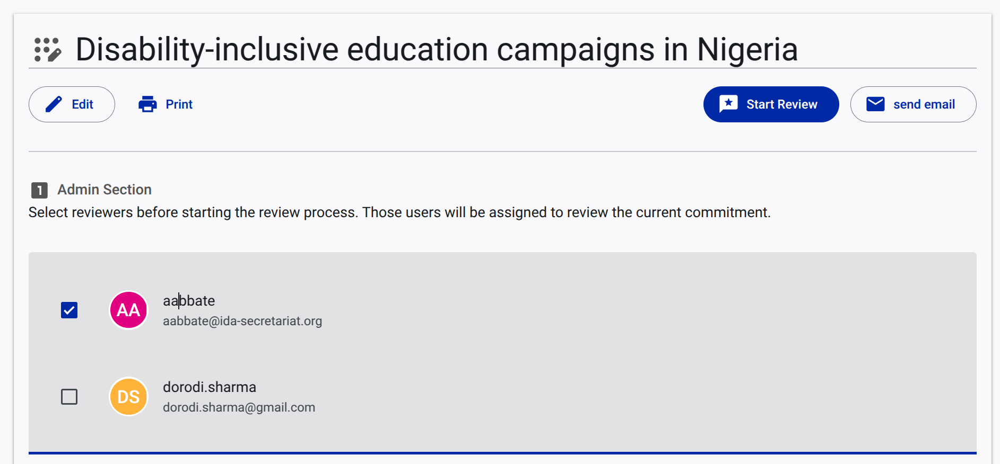
>
> screenshot of the review process with reviewer selected. `Start review` button is enabled.

The admin section is presented on top of user section (with the content of the commitment).

## 0.2.1 [2025-02-11]

GDS team members with `editor` role can now edit commitments from the admin panel.

## 0.2.0 [2025-02-10]

This release note focuses on better email handling.

### Email

Internally, We have completely revamped the email handling system (using a Finite State Machine instead of an API endpoint).

User-facing changes:

- The app would know which call to action to add at the end of the message, depending on the type of entity that is involved in the email (commitment or organisation).
- The app adds a first liner With dear display name, without the need to include it in email templates.
- It is now possible to send emails directly from commitment page. Those emails will be sent to the owner of the commitment.

### Other changes

- We have added a way to edit organizations from the admin panel.
- The commitment page adds a link to the organization.
- The commitment page now displays the organization name with the type of organisation.
